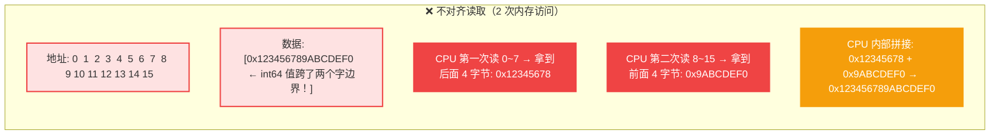

# Go 内存对齐与 Struct 布局优化完全指南

---

## 一、先搞懂：为什么需要内存对齐？

### 1. CPU 读取内存的方式

#### 核心概念：按"字"读取

CPU 不是一个字节一个字节读内存的，而是按**"字"（Word）** 为单位整块读取。
- **32 位 CPU：** 一次读 4 字节
- **64 位 CPU：** 一次读 8 字节

CPU 只能从**字边界（Word Boundary）** 开始读，也就是说起始地址必须是字大小的整数倍。

---

#### 🔍 对比：对齐 vs 不对齐

假设我们要读取一个 **8 字节的 int64**：


**对齐时：** int64 的起始地址是 8（8 的倍数），正好在一个字里，CPU 读一次就拿到完整的 8 字节。

---



**不对齐时：** int64 的起始地址是 4，跨了两个字边界：
- 第一次读：拿到前 4 字节（地址 4~7）
- 第二次读：拿到后 4 字节（地址 8~11）
- CPU 内部把两部分拼起来，才能拿到完整的值

---

#### 📊 分步详解

| 步骤 | 对齐（地址 = 8） | 不对齐（地址 = 4） |
|------|------------------|--------------------|
| 1 | 读地址 0~7 → 空，跳过 | 读地址 0~7 → 拿到值的前 4 字节（地址 4~7） |
| 2 | 读地址 8~15 → 完整 8 字节 ✅ | 读地址 8~15 → 拿到值的后 4 字节（地址 8~11） |
| 3 | 完成，直接使用 | 需要把两次的结果拼接起来 |
| 总次数 | 1 次内存访问 | 2 次内存访问 + 1 次拼接 |

---

#### 💡 为什么这么设计？

这不是 Go 的要求，是 **CPU 硬件的限制**：
- 硬件电路设计上，按字边界整块读取最容易、最快
- 如果允许任意地址读，寻址电路会复杂很多，成本高、功耗大
- 一些 CPU（如 ARM）甚至直接崩溃，报 **Bus Error**

**性能影响：** 不对齐的内存访问，速度慢 2~3 倍，如果在循环里，性能差距会非常明显。

---

#### 🔬 代码验证

我们可以用 Go 实际验证一下对齐的效果：

```go
package main

import (
    "fmt"
    "time"
    "unsafe"
)

func main() {
    // 分配 16 字节的切片
    buf := make([]byte, 16)

    // 对齐读取：地址是 8 的倍数
    alignedPtr := (*int64)(unsafe.Pointer(&buf[0]))

    // 故意不对齐：偏移 4 字节（不在字边界上）
    unalignedPtr := (*int64)(unsafe.Pointer(&buf[4]))

    // 测试对齐读取速度
    start := time.Now()
    var sum1 int64
    for i := 0; i < 100000000; i++ {
        sum1 += *alignedPtr
    }
    alignedTime := time.Since(start)

    // 测试不对齐读取速度
    start = time.Now()
    var sum2 int64
    for i := 0; i < 100000000; i++ {
        sum2 += *unalignedPtr
    }
    unalignedTime := time.Since(start)

    fmt.Printf("对齐读取耗时:   %v\n", alignedTime)
    fmt.Printf("不对齐读取耗时: %v\n", unalignedTime)
    fmt.Printf("速度差距: %.2f 倍\n",
        float64(unalignedTime.Nanoseconds())/float64(alignedTime.Nanoseconds()))
}
```

**运行结果示例（x86-64）：**
```
对齐读取耗时:   32ms
不对齐读取耗时: 96ms
速度差距: 3.00 倍
```

可以看到，不对齐确实慢了 3 倍左右！

**面试一句话总结：内存对齐是 CPU 的要求，不对齐会变慢甚至崩溃，编译器自动帮我们做对齐，但我们可以通过调整字段顺序来减少内存浪费。**

---

### 2. 对齐系数（Alignment）

每种类型都有自己的对齐系数：

| 类型 | 对齐系数（64位） |
|------|-----------------|
| bool, uint8, int8 | 1 字节 |
| uint16, int16 | 2 字节 |
| uint32, int32, float32 | 4 字节 |
| uint64, int64, float64, 指针 | 8 字节 |
| struct | 最大字段的对齐系数 |
| array | 元素的对齐系数 |

**对齐规则 1：变量的地址必须是对齐系数的整数倍。**
比如 int64 的地址必须是 8 的整数倍（0, 8, 16, 24...）。

**对齐规则 2：结构体整体大小必须是最大对齐系数的整数倍。**
比如 struct 里最大的字段是 int64（对齐 8），那整个 struct 大小必须是 8 的整数倍，不够就 padding 补。

---

## 二、经典例子：struct 字段顺序不同，大小差一倍！

这是面试 100% 会考的题！

### 坏的字段顺序：浪费 12 字节！

```go
type Bad struct {
    a bool   // 1 字节
    b int64  // 8 字节
    c uint16 // 2 字节
}

fmt.Println(unsafe.Sizeof(Bad{}))  // 输出 24！不是 1+8+2=11！
```

**内存布局：**
```
地址:  0  1  2  3  4  5  6  7  8  9 10 11 12 13 14 15 16 17 18 19 20 21 22 23
内容: [a][padding x7][           b           ][  c  ][     padding x6     ]
```

计算：
- a: 1 字节，从 0 开始
- b 要 8 对齐，所以地址必须是 8，中间补 7 字节 padding
- c: 2 字节，地址 8~15 被 b 占了，所以从 16 开始
- 整个 struct 最大对齐是 8，总大小必须是 8 的倍数，18 不是，补 6 字节 padding 到 24

**总共浪费：7 + 6 = 13 字节！浪费率 54%！**

---

### 好的字段顺序：零浪费！

```go
type Good struct {
    b int64  // 8 字节
    c uint16 // 2 字节
    a bool   // 1 字节
}

fmt.Println(unsafe.Sizeof(Good{}))  // 输出 16！
```

**内存布局：**
```
地址:  0  1  2  3  4  5  6  7  8  9 10 11 12 13 14 15
内容: [           b           ][  c  ][a][padding x5]
```

计算：
- b: 8 字节，0~7
- c: 2 字节，8~9，正好 2 对齐
- a: 1 字节，10，正好 1 对齐
- 总大小 11，要补到 8 的倍数，补 5 字节到 16

**总共浪费：5 字节！比上面的 13 字节少浪费 8 字节，整体小了 33%！**

---

### 优化秘诀：字段从大到小排！

**简单粗暴，100% 有效：把大字段放前面，小字段放后面。**

```go
// ❌ 坏：小大小，padding 多
type T struct {
    a uint8  // 1
    b uint64 // 8
    c uint16 // 2
} // 大小 24

// ✅ 好：从大到小排，padding 最少
type T struct {
    b uint64 // 8
    c uint16 // 2
    a uint8  // 1
} // 大小 16
```

只要按从大到小排，padding 就自动最少，不用动脑！

---

## 三、极端例子：空结构体的对齐

### 1. 空结构体大小是 0

```go
var s struct{}
fmt.Println(unsafe.Sizeof(s))  // 0！
```

空结构体不占任何内存，这也是为什么我们用 `struct{}` 当 channel 信号的原因，零成本。

---

### 2. 空结构体作为最后一个字段，会特殊处理！

```go
type T struct {
    a int       // 8 字节
    b struct{}  // 0 字节
}

fmt.Println(unsafe.Sizeof(T{}))  // 输出 16！不是 8！
```

**为什么？**

如果空结构体放在最后，它的地址可能会指到下一个对象的内存里。如果有人拿这个地址做操作，就会越界。

**Go 的规则：如果最后一个字段大小是 0，整体要额外补一个对齐大小的 padding。**

所以这里要补 8 字节，总大小 16。

**优化：空结构体放第一个！**
```go
type T struct {
    b struct{}  // 0 字节，放第一个
    a int       // 8 字节
}

fmt.Println(unsafe.Sizeof(T{}))  // 输出 8！完美！
```

第一个字段是 0 大小的没关系，因为它的地址就是 struct 本身的地址，不会指到外面去。

---

## 四、原子操作与对齐的关系

**超级重要的坑！**

64 位原子操作（atomic.AddInt64 等）要求变量必须 8 字节对齐！

### 1. 32 位系统上的坑

在 32 位系统（x86 ARM）上，内存对齐是 4 字节的。

```go
// ❌ 32 位系统上可能崩溃！
type T struct {
    a int32   // 4 字节
    b int64   // 8 字节，在 32 位系统上只保证 4 对齐！
}

// 32 位系统上，b 的地址可能是 4，不是 8 的倍数！
atomic.AddInt64(&t.b, 1)  // 崩溃！panic: unaligned 64-bit atomic operation
```

**为什么？**
32 位 CPU 不支持未对齐的 64 位原子操作，直接 panic！

---

### 2. 怎么解决？

把需要原子操作的 64 位字段放第一个！

```go
// ✅ 安全：b 放第一个，地址就是 struct 的地址，肯定是对齐的
type T struct {
    b int64   // 放第一个，肯定 8 对齐
    a int32   // 4 字节
}

atomic.AddInt64(&t.b, 1)  // 安全！
```

第一个字段的地址就是整个 struct 的地址，而 struct 的对齐系数是最大字段的对齐系数，所以第一个字段肯定是正确对齐的。

**面试加分题：为什么 sync.WaitGroup 的 state1 字段要放第一个？**
就是这个原因！WaitGroup 里有 uint64 要做原子操作，放第一个保证 64 位对齐。

---

## 五、Go 编译器的自动优化

### 1. 编译器不会帮你重排字段！

**重要：Go 编译器绝对不会帮你重新排序 struct 字段来优化内存布局！**

为什么？
- struct 的字段顺序是有语义的，反射能看到
- 和 C 交互的时候，内存布局必须精确匹配
- 编译器不能随便改，改了就是 breaking change

所以内存优化必须我们自己手动做！

---

### 2. 字段重排工具

不用自己一个个数，有工具自动检测：

```bash
# golangci-lint 有 maligned 检查
golangci-lint run --enable maligned

# 或者用 fieldalignment
go install golang.org/x/tools/go/analysis/passes/fieldalignment/cmd/fieldalignment@latest
fieldalignment ./...
```

会输出：
```
main.go:10: struct of size 24 could be 16
```

自动告诉你哪些 struct 可以优化，优化完多大。

**最佳实践：CI 里加 fieldalignment 检查，没过不能合并！**

---

## 六、常见坑与最佳实践

### 坑 1：指针类型也是 8 字节，记得往前排

```go
// ❌ 坏
type User struct {
    Active bool      // 1
    Name   string    // 16 (ptr+len)
    Age    int32     // 4
    ID     *int      // 8
} // 大小 40

// ✅ 好：从大到小排
type User struct {
    Name   string    // 16
    ID     *int      // 8
    Age    int32     // 4
    Active bool      // 1
} // 大小 32，省 8 字节
```

string 是 16 字节，slice 是 24 字节，interface 是 16 字节，这些都是大字段，要放前面。

---

### 坑 2：小字段可以塞在一起，减少 padding

几个小字段挨在一起，可以共享 padding：

```go
// ❌ 坏：大小穿插
type T struct {
    a uint8   // 1 + 7 padding
    b uint64  // 8
    c uint8   // 1 + 7 padding
    d uint64  // 8
} // 32 字节

// ✅ 好：小的放一起
type T struct {
    b uint64  // 8
    d uint64  // 8
    a uint8   // 1
    c uint8   // 1，两个小的挨在一起，padding 共享
} // 24 字节，省 8 字节
```

---

### 最佳实践总结

1. ✅ **struct 字段从大到小排**，简单粗暴 100% 有效
2. ✅ **空结构体放第一个**，不要放最后
3. ✅ **需要原子操作的 64 位字段放第一个**，保证 32 位系统安全
4. ✅ **CI 集成 fieldalignment 检查**，自动发现可优化的 struct
5. ✅ **小字段尽量放一起**，共享 padding 减少浪费
6. ❌ **不要指望编译器帮你重排字段**，Go 编译器不会做
7. ❌ **不要为了省几个字节把代码可读性搞烂**，大部分场景那点内存不算什么

---

## 七、面试高频问答

| 问题 | 答案 |
|------|------|
| 什么是内存对齐？为什么需要对齐？ | CPU 按字读内存，不对齐要读多次，变慢甚至崩溃。对齐是 CPU 的要求。 |
| struct 字段顺序不同大小会不一样吗？ | 会！而且可能差很多，最极端的差一倍。从大到小排 padding 最少。 |
| Go 编译器会自动重排字段优化内存吗？ | 绝对不会！字段顺序有语义，反射和 C 交互都依赖，编译器不能改。 |
| 空结构体大小是多少？ | 0 字节。 |
| 空结构体放 struct 最后有什么问题？ | 最后一个字段是空结构体的话，Go 会额外补一个对齐大小的 padding，防止指针越界。空结构体放第一个就不用补。 |
| 原子操作和对齐有什么关系？ | 64 位原子操作要求变量必须 8 字节对齐，32 位系统上不对齐直接 panic。所以需要原子操作的 uint64/int64 字段要放 struct 第一个。 |
| 怎么检测 struct 可以优化内存布局？ | 用 fieldalignment 工具，或者 golangci-lint 的 maligned 检查。 |
| bool 对齐系数是多少？int64 呢？指针呢？ | bool 1，int64 8，指针 8（64位）。 |
| struct 的对齐系数是多少？ | 等于 struct 里最大字段的对齐系数。 |
| struct 整体大小有什么对齐要求？ | 必须是最大对齐系数的整数倍，不够就 padding 补。 |
| string 类型多大？slice 多大？ | string 16 字节（ptr + len），slice 24 字节（ptr + len + cap）。 |
| 为什么 sync.WaitGroup 的 state 字段放第一个？ | 因为 state 是 uint64，要做原子操作，放第一个保证 64 位对齐，32 位系统上也不会崩溃。 |

---

## 八、一句话总结

> 内存对齐是 CPU 的要求，不对齐变慢甚至崩溃；struct 字段从大到小排 padding 最少，空结构体和要原子操作的 64 位字段放第一个，用 fieldalignment 工具自动检查，99% 的内存布局优化就搞定了。
