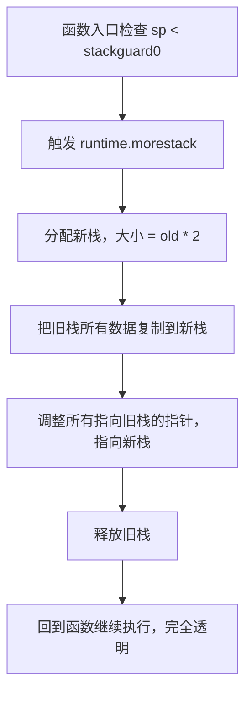
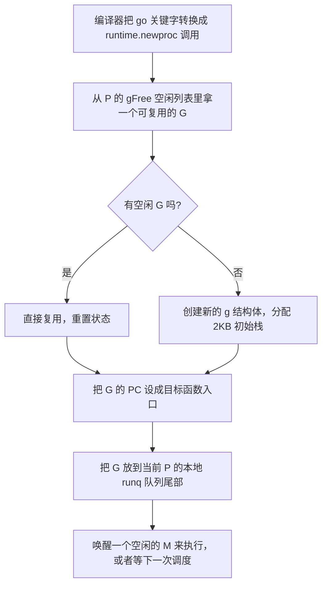
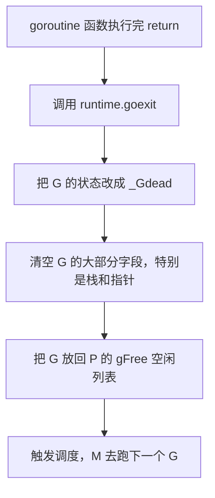

# Goroutine 基础与栈管理深度解析

---

## 一、先搞懂：goroutine vs 线程 vs 协程

### 1. 三者核心对比

| 特性 | 内核线程（Thread） | goroutine | 协程（Coroutine） |
|------|-------------------|-----------|------------------|
| **调度者** | 操作系统内核 | Go runtime 用户态调度器 | 应用层代码手动调度 |
| **切换开销** | 几微秒 ~ 几十微秒，要进内核 | 几十纳秒 ~ 几百纳秒，纯用户态 | 几纳秒，完全手动 |
| **栈大小** | 固定 8MB（Linux） | 初始 2KB，动态伸缩 | 自己管理，通常几 KB |
| **并发量级** | 几千个就开始卡 | 轻松几十万甚至上百万 | 看具体实现 |
| **抢占式** | 是，操作系统调度 | Go 1.14+ 是异步抢占 | 否，协作式，必须主动让出 |
| **数据同步** | 锁、信号量 | channel、锁、原子操作 | 通常共享内存无锁 |

**面试一句话总结：** goroutine 是"用户态线程"，由 Go runtime 自己调度，不需要进入内核，所以创建和切换成本极低，可以轻松开几十万个。

---

### 2. 为什么 goroutine 这么轻量？

三个核心原因：

1. **栈小且可伸缩**：初始只有 2KB，不够了自动扩容，用多少长多少
2. **调度在用户态**：切换不需要进入内核态，不需要保存全部寄存器
3. **复用内核线程**：M:N 调度，N 个 goroutine 只需要 M 个内核线程

---

## 二、goroutine 底层数据结构

runtime 里 g 结构体的核心字段：

```go
// src/runtime/runtime2.go
type g struct {
    // 栈信息
    stack       stack   // 栈的内存范围 [lo, hi]
    stackguard0 uintptr // 栈增长哨兵，sp 小于这个值就触发 morestack

    // 执行上下文
    pc uintptr // 程序计数器，下一条要执行的指令地址
    sp uintptr // 栈指针
    bp uintptr // 基址指针

    // ID 和状态
    goid    int64  // goroutine ID
    status  uint32 // G 的状态：_Gidle, _Grunnable, _Grunning...

    // 绑定关系
    m *m // 当前绑定的 M
    p *p // 当前所属的 P

    // 调度相关
    schedlink guintptr // 链表指针，串在 runq 里

    // ... 还有几十上百个其他字段
}
```

每个 g 结构体本身只有几百字节，加上初始 2KB 栈，一个 goroutine 总共也就几 KB，所以 100 万个 goroutine 也就几个 GB 内存。

---

## 三、栈扩容与缩容机制（面试高频！）

### 1. 栈扩容：morestack

Go 编译器会在每个函数入口插一段检查代码：

```go
// 函数入口伪代码
func funcEntry() {
    // 检查栈够不够
    if sp < g.stackguard0 {
        runtime.morestack()  // 触发栈扩容
    }
    // 正常执行函数
}
```

**完整扩容流程：**



**关键点：**
- 新栈大小 = 旧栈 × 2，指数增长
- 所有指针都要调整，这是最复杂的一步
- 对上层代码完全透明，代码感知不到

---

### 2. 栈缩容：shrinkstack

Go 1.3 引入了栈缩容，栈用完了还能变小。

**触发时机：** GC 扫描栈的时候，如果栈只用了不到 1/4，就触发缩容。

```go
// 伪代码
func shrinkstack(gp *g) {
    used := gp.stack.hi - gp.stackguard0
    total := gp.stack.hi - gp.stack.lo

    // 只用了不到 1/4，缩容一半
    if used < total/4 {
        newSize := total / 2
        // 分配新栈，复制数据，释放旧栈
        // ...
    }
}
```

**栈不会无限缩：** 最小 2KB，不能比初始更小。

---

### 3. 栈大小演进历史

| Go 版本 | 初始栈大小 | 扩容方式 | 缩容 |
|---------|-----------|---------|------|
| Go 1.0 ~ 1.3 | 8KB | 分段栈（分段） | 无 |
| Go 1.4 | 2KB | 连续栈（复制整体） | 无 |
| Go 1.5+ | 2KB | 连续栈，×2 增长 | GC 时检查，缩容 1/2 |

**分段栈 vs 连续栈：**
- **分段栈（Go 1.0~1.3）**：链表串起来，扩容不复制，但有 "hot split" 问题（函数在栈边界反复调用反复扩容缩容）
- **连续栈（Go 1.4+）**：一整块内存，扩容整体复制，没有 hot split 问题，现在的方案

**面试加分项：** 你知道 Go 1.4 为什么把初始栈从 8KB 改成 2KB 吗？
> 因为很多 goroutine 根本用不了 8KB，太浪费了。降到 2KB 后，同样内存可以开 4 倍的 goroutine，并发能力大幅提升。

---

## 四、goroutine 创建与退出完整流程

### 1. 创建：go func() {} 背后发生了什么？

```go
go func() {
    // ...
}()
```

这句代码的底层执行流程：



**重点：goroutine 创建成本极低！**
- 大部分时候只是从 gFree 拿一个现成的 G 复用
- 不需要进入内核，纯用户态操作
- 几百纳秒就完成了

---

### 2. 退出：goroutine 执行完了会怎样？



**核心设计：G 是可复用的！**
- 执行完的 G 不会立即销毁，缓存起来给下次用
- gFree 列表有大小限制，超过了才会真的释放
- 所以反复创建销毁 goroutine 成本也很低

---

## 五、goroutine 泄漏（90% 的 Go 程序员都踩过）

### 1. 什么是 goroutine 泄漏？

goroutine 阻塞了，永远无法退出，也永远不会被 GC 回收，占着内存和栈，越积越多。

**表现：**
- pprof 里 goroutine 数量一直在涨，从不下降
- 内存缓慢上涨，但 heap profile 看不出哪里泄漏
- 服务运行几天后越来越卡，最后 OOM

---

### 2. 最常见的泄漏场景 Top 5

#### 场景 1：channel 永远没人读/写（最常见！）

```go
// ❌ 泄漏：ch 没人读，goroutine 永远卡在 <-ch
func bad() {
    ch := make(chan int)
    go func() {
        val := <-ch  // 永远等在这里！G 泄漏！
        fmt.Println(val)
    }()
    // 函数返回了，ch 没人写，goroutine 永远卡住
}
```

```go
// ❌ 反过来也一样：没人读，写的人永远卡住
func bad2() {
    ch := make(chan int)
    go func() {
        ch <- 1  // 永远等在这里！
    }()
    // 函数返回了，没人读
}
```

**修复：用带 buffer 的 channel，或者用 select + timeout**

```go
// ✅ 修复 1：buffer size = 1，写的人不会卡住
ch := make(chan int, 1)
go func() {
    ch <- 1  // buffer 没满，直接返回，不会卡住
}()
```

```go
// ✅ 修复 2：select + timeout，永远不会无限等
select {
case val := <-ch:
    fmt.Println(val)
case <-time.After(time.Second):
    fmt.Println("timeout")
}
```

---

#### 场景 2：互斥锁死锁

```go
// ❌ 死锁：A 等 B，B 等 A，两个 goroutine 永远卡住
func deadlock() {
    var mu1, mu2 sync.Mutex

    go func() {
        mu1.Lock()
        time.Sleep(100 * time.Millisecond)
        mu2.Lock()  // 永远等不到 mu2！
        // ...
    }()

    mu2.Lock()
    time.Sleep(100 * time.Millisecond)
    mu1.Lock()  // 永远等不到 mu1！
}
```

两个 G 都卡住，都泄漏了。

---

#### 场景 3：http 请求没有超时（生产重灾区！）

```go
// ❌ 泄漏：http.DefaultClient 没有超时！
func badHTTP() {
    resp, err := http.Get("http://slow-server.com")  // 可能永远卡住！
    // 如果对端不返回，这个 goroutine 永远卡在这里
}
```

**修复：一定要设置 Timeout！**
```go
// ✅ 正确：所有 http client 都要设超时
client := &http.Client{
    Timeout: 10 * time.Second,
}
resp, err := client.Get(url)
```

---

#### 场景 4：time.Ticker 没 Stop

```go
// ❌ 泄漏：Ticker 不用了没 Stop，内部 goroutine 永远跑
func badTicker() {
    ticker := time.NewTicker(time.Second)
    go func() {
        for range ticker.C {
            // do something
        }
    }()
    // 函数返回了，ticker 没 Stop，内部 goroutine 永远跑！
}
```

**修复：defer Stop**
```go
// ✅ 正确
ticker := time.NewTicker(time.Second)
defer ticker.Stop()
```

---

#### 场景 5：context 没取消

```go
// ❌ 泄漏：WithCancel 创建的 ctx 用完没 cancel
func badCtx() {
    ctx, _ := context.WithCancel(context.Background())
    go func() {
        <-ctx.Done()  // 永远等不到 cancel！G 泄漏！
    }()
    // 函数返回了，ctx 没 cancel
}
```

**修复：defer cancel()**
```go
// ✅ 正确
ctx, cancel := context.WithCancel(context.Background())
defer cancel()
```

---

### 3. 怎么排查 goroutine 泄漏？

**第一步：看 goroutine 数量**
```bash
# pprof 看 goroutine 数量
go tool pprof http://localhost:6060/debug/pprof/goroutine
# 输入 top 看数量
```

**第二步：看所有 goroutine 的栈**
```bash
# debug=2 会打印所有 goroutine 的完整栈
curl http://localhost:6060/debug/pprof/goroutine?debug=2
```

**第三步：找卡在同一个地方的大量 goroutine**
- 几百几千个 goroutine 都卡在同一个 `chan send` / `chan receive`
- 基本就是泄漏点了

---

### 4. 防泄漏最佳实践

1. ✅ **所有 channel 操作考虑会不会永久阻塞**
2. ✅ **所有 http 请求必须设 Timeout**
3. ✅ **time.Ticker 不用了必须 Stop**
4. ✅ **context.WithCancel 必须 defer cancel()**
5. ✅ **不要用无 buffer channel 在 goroutine 之间传值**
6. ✅ **高并发场景用 worker pool，不要无限开 goroutine**

---

## 六、goroutine ID 能拿到吗？

**面试高频问题：怎么获取当前 goroutine ID？**

答案：**官方不提供，也强烈不建议用！**

**为什么不提供？**
1. Go 不想让大家把 goroutine 当 thread-local 来用
2. 想保持 goroutine 的轻量和可迁移性
3. 如果大家都依赖 goid，G 就不能随便 M 之间迁移了

**但非要拿也能拿到（hack 方式）：**
```go
func getGoroutineID() uint64 {
    var buf [64]byte
    n := runtime.Stack(buf[:], false)
    // 栈信息开头就是 "goroutine 123 ..."
    // 解析字符串拿 ID
    // ...
}
```

**强烈不建议在生产代码里用！**
- 脆弱，Go 版本变了格式可能变
- 违反 Go 的设计哲学
- 容易写出有线程安全问题的代码

---

## 七、面试高频问答

| 问题 | 答案 |
|------|------|
| goroutine 和线程的区别？ | goroutine 是用户态调度，初始栈 2KB 动态伸缩，切换开销几十纳秒，轻松开几十万；线程是内核调度，固定 8MB 栈，切换开销几微秒，几千个就卡了。 |
| goroutine 初始栈多大？ | 2KB（Go 1.4 开始），之前是 8KB。 |
| goroutine 栈最大多大？ | 64 位系统 1GB，32 位系统 250MB。 |
| 栈扩容怎么工作的？ | 函数入口检查栈不够就触发 morestack，分配 2 倍大的新栈，把旧栈所有数据和指针都复制过去，对上层完全透明。 |
| 栈会缩容吗？什么时候缩？ | Go 1.5+ 会缩容。GC 扫描栈的时候，如果栈只用了不到 1/4，就缩成原来的 1/2。 |
| goroutine 执行完了会销毁吗？ | 不会立即销毁，会放到 P 的 gFree 空闲列表缓存起来，下次创建新 goroutine 直接复用，降低开销。 |
| 什么是 goroutine 泄漏？怎么排查？ | goroutine 永久阻塞无法退出就是泄漏。用 pprof 看 goroutine 数量，debug=2 打印所有栈，找大量卡在同一个位置的 G。 |
| goroutine 泄漏最常见的原因？ | channel 没人读/写、http 没超时、死锁、Ticker 没 Stop、context 没 cancel。 |
| 怎么获取 goroutine ID？官方支持吗？ | 官方不提供，也不建议用。可以 hack runtime.Stack 解析字符串拿到，但生产代码绝对不要用。 |
| 为什么 Go 1.4 把初始栈从 8KB 改成 2KB？ | 大部分 goroutine 用不了 8KB，太浪费。降到 2KB 后同样内存可以开 4 倍 goroutine，并发能力大幅提升。 |
| 分段栈和连续栈的区别？ | Go 1.3 之前是分段栈，链表串起来，扩容不复制但有 hot split 问题；Go 1.4 开始是连续栈，一整块内存，扩容整体复制，没有 hot split。 |
| go func() {} 创建 goroutine 要进内核吗？ | 不需要，纯用户态操作，从 gFree 拿一个复用或者创建新的，放到 P 的本地队列就完了，几百纳秒搞定。 |

---

## 八、一句话总结

> goroutine 是 Go 并发的基石，初始 2KB 小栈指数扩容，用完回收复用，用户态调度切换成本极低；90% 的生产问题都是 goroutine 泄漏，记住 channel、http timeout、Ticker、context 这四个最常见的泄漏点就够了。
