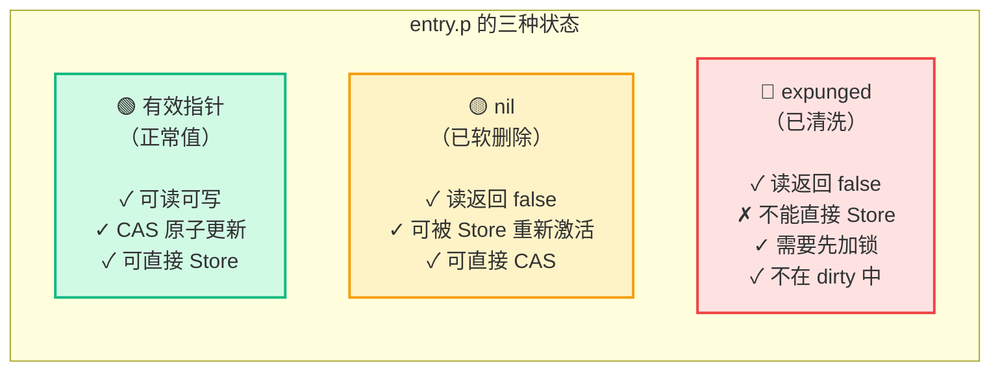
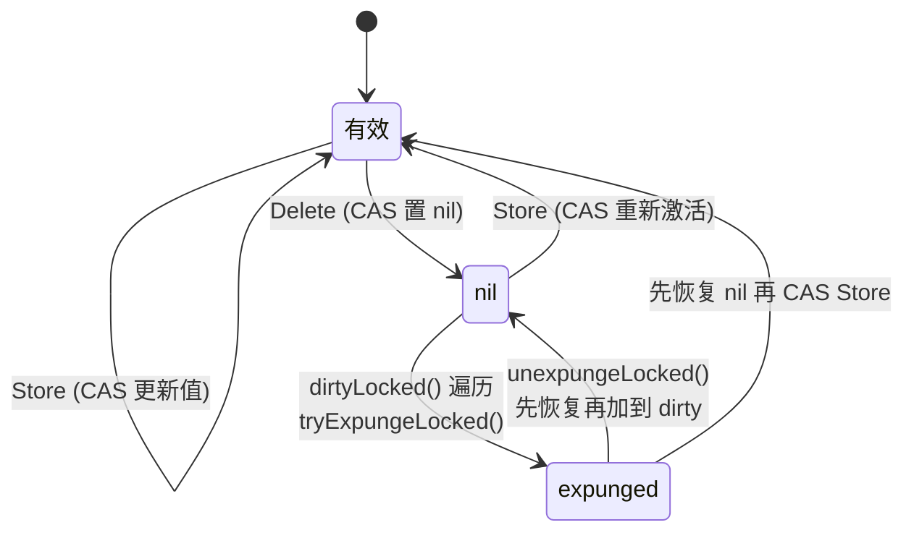
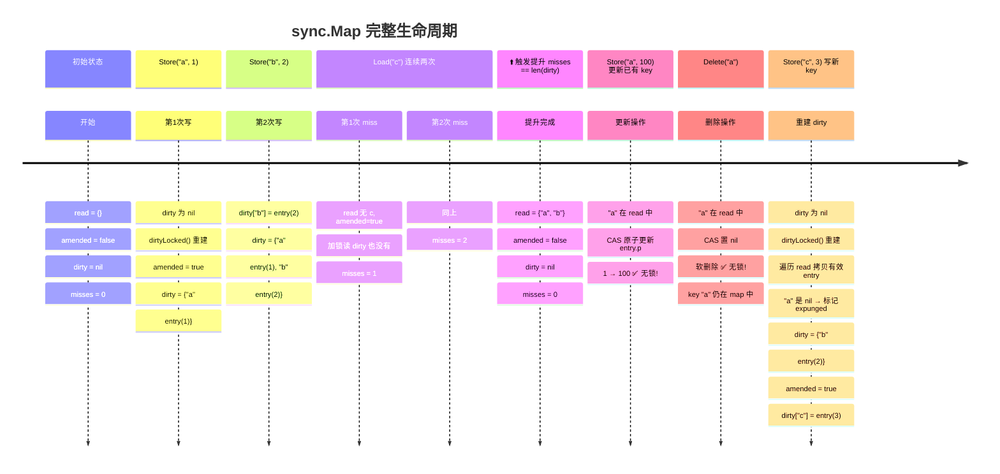
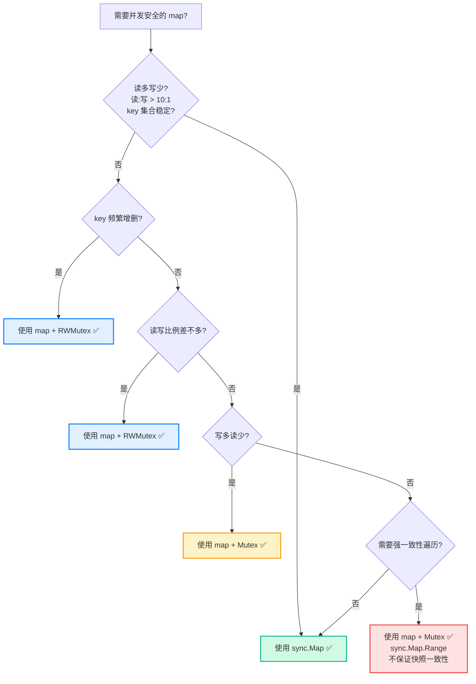

# sync.Map 完整解析：从双 Map 设计到 HashTrieMap

---

## 一、为什么需要 sync.Map？

### 1. 普通 map 的并发问题

Go 的内置 `map` **不是并发安全的**，多个 goroutine 同时读写会直接 fatal error：

```go
m := make(map[string]int)
// goroutine 1
go func() { m["key"] = 1 }()
// goroutine 2
go func() { _ = m["key"] }()
// 💥 fatal error: concurrent map read and map write
```

### 2. 传统的解决方案：map + Mutex/RWMutex

```go
type SafeMap struct {
    mu sync.RWMutex
    m  map[string]int
}

func (s *SafeMap) Get(key string) int {
    s.mu.RLock()
    defer s.mu.RUnlock()
    return s.m[key]
}

func (s *SafeMap) Set(key string, val int) {
    s.mu.Lock()
    defer s.mu.Unlock()
    s.m[key] = val
}
```

**问题：**
- 读多写少场景下，RWMutex 的 RLock/Unlock 仍有原子操作开销
- 写操作时所有读都被阻塞
- 高并发读场景下锁竞争严重

### 3. sync.Map 的目标

**读多写少、key 稳定**的场景下，用**空间换时间**，实现**读操作无锁**。

---

## 二、经典实现（Go 1.9 ~ 1.23）：双 Map 设计

### 1. 核心数据结构

```go
type Map struct {
    mu Mutex              // 保护 dirty map 的互斥锁

    read atomic.Value     // 存 readOnly，原子操作无锁读
                         // 实际类型：readOnly

    dirty map[any]*entry  // 新写入的 key 存这里，需要加锁

    misses int            // read 未命中计数器
}

type readOnly struct {
    m       map[any]*entry  // 只读 map（注意：值是 *entry 指针）
    amended bool            // dirty 中是否有 read 中没有的 key
}

type entry struct {
    p unsafe.Pointer  // 指向实际 value 的指针
}
```

**关键设计：key 在 read 和 dirty 中共享同一个 `*entry` 指针！**

```mermaid
graph LR
    A[read.m["user1"]] --> C[*entry]
    B[dirty["user1"]] --> C[*entry]
    C --> D[p → &User{Name: "Alice"}]

    style A fill:#e1f0ff,stroke:#007aff,stroke-width:2px
    style B fill:#fff3e0,stroke:#ff9500,stroke-width:2px
    style C fill:#d1fae5,stroke:#10b981,stroke-width:2px
```

这意味着修改已有 key 的 value，只需要原子修改 entry.p，不需要加锁！

这意味着修改已有 key 的 value，只需要原子修改 entry.p，不需要加锁！

---

### 2. entry 的三种状态

entry.p 指针有三种可能的值：



| 状态 | entry.p 值 | 含义 | 能否直接 Store |
|------|-----------|------|---------------|
| **有效** | `&value` | 正常的键值对 | 可以，CAS 原子更新 |
| **nil** | `nil` | 已被 Delete 软删除 | 可以，CAS 原子更新重新激活 |
| **expunged** | `expunged` | 已清洗，不在 dirty 中 | 不行，必须加锁后先加回 dirty |

**状态转换图：**



**为什么需要 expunged？**

- nil 表示"已删除但还在 dirty 中"
- expunged 表示"已删除且不在 dirty 中"
- 当 dirty 为 nil 需要重建时，遍历 read 把有效 entry 拷贝到 dirty
- 此时把 nil 的 entry 标记为 expunged，表示"这个 entry 不在 dirty 中了"
- 后续如果要 Store 这个 key，必须先加锁把它加回 dirty

---

### 3. 五个核心操作详解

#### (1) Load — 读操作

```go
func (m *Map) Load(key any) (value any, ok bool) {
    // 第一步：无锁读 read map（快速路径）
    read, _ := m.read.Load().(readOnly)
    e, ok := read.m[key]

    // 第二步：read 没找到，且 dirty 有新 key
    if !ok && read.amended {
        m.mu.Lock()  // 加锁
        // 双重检查：加锁期间 read 可能被提升了
        read, _ = m.read.Load().(readOnly)
        e, ok = read.m[key]
        if !ok && read.amended {
            // 第三步：从 dirty 读
            e, ok = m.dirty[key]
            // 记录一次 miss
            m.missLocked()
        }
        m.mu.Unlock()
    }

    if !ok {
        return nil, false
    }
    return e.load()  // 原子读 entry.p
}
```

**流程图：**

```mermaid
flowchart TD
    A[Start: Load(key)] --> B{key 在 read.m 中?}

    B -->|是| C[e.load() 原子读值]
    C --> D[返回 (value, true)]
    style C fill:#d1fae5,stroke:#10b981,stroke-width:2px
    style D fill:#d1fae5,stroke:#10b981,stroke-width:2px

    B -->|否| E{read.amended == true?}
    E -->|否| F[返回 (nil, false)]
    style F fill:#d1fae5,stroke:#10b981,stroke-width:2px

    E -->|是| G[🔒 加锁 mu.Lock()]
    G --> H[双重检查 read<br/>（加锁期间可能已提升）]
    H --> I{key 现在在 read.m 中?}
    I -->|是| J[读 read.m[key]]
    I -->|否| K[读 dirty[key]]
    K --> L[missLocked() 计数+1]
    L --> M{misses >= len(dirty)?}
    M -->|是| N[⬆️ dirty 提升为 read]
    M -->|否| O[🔓 解锁]
    J --> O
    N --> O
    O --> P[返回结果]

    style G fill:#fee2e2,stroke:#ef4444,stroke-width:2px
    style N fill:#fff3e0,stroke:#ff9500,stroke-width:2px

    note right of D ✅ 无锁!
    note right of F ✅ 无锁!
```

---

#### (2) Store — 写操作

```go
func (m *Map) Store(key, value any) {
    // 快速路径：key 在 read 中存在
    read, _ := m.read.Load().(readOnly)
    if e, ok := read.m[key]; ok && e.tryStore(&value) {
        return  // CAS 成功，直接返回 ✅ 无锁！
    }

    // 慢路径：key 不在 read 中，或 entry 是 expunged
    m.mu.Lock()
    read, _ = m.read.Load().(readOnly)
    if e, ok := read.m[key]; ok {
        if e.unexpungeLocked() {
            // entry 是 expunged，先恢复为 nil，再加到 dirty
            m.dirty[key] = e
        }
        e.storeLocked(&value)  // 原子更新值
    } else if e, ok := m.dirty[key]; ok {
        // key 在 dirty 中，直接更新
        e.storeLocked(&value)
    } else {
        // key 全新，加到 dirty
        if !read.amended {
            // dirty 为 nil，需要先初始化
            m.dirtyLocked()
            m.read.Store(readOnly{m: read.m, amended: true})
        }
        m.dirty[key] = newEntry(value)
    }
    m.mu.Unlock()
}
```

**流程图：**

```mermaid
flowchart TD
    A[Start: Store(key, value)] --> B{key 在 read 中?}

    B -->|是| C[tryStore CAS 更新值]
    C --> D{CAS 成功?}
    D -->|是| E[返回]
    style E fill:#d1fae5,stroke:#10b981,stroke-width:2px
    note right of E ✅ 无锁!

    B -->|否| F[🔒 加锁]
    D -->|失败<br/>(entry 是 expunged)| F

    F --> G[双重检查 read]
    G --> H{key 在 read 中?}

    H -->|是| I{entry 是 expunged?}
    I -->|是| J[unexpunge<br/>标记为 nil<br/>加回 dirty]
    J --> K[原子更新 entry.p]
    I -->|否| K

    H -->|否| L{key 在 dirty 中?}
    L -->|是| M[直接更新 entry.p]
    L -->|否| N[全新 key]
    N --> O{dirty 为 nil?}
    O -->|是| P[dirtyLocked() 重建 dirty<br/>遍历 read 拷贝有效 entry]
    O -->|否| Q
    P --> Q[amended = true]
    Q --> R[dirty[key] = newEntry(value)]

    K --> S[🔓 解锁]
    M --> S
    R --> S
    S --> T[返回]

    style F fill:#fee2e2,stroke:#ef4444,stroke-width:2px
    style P fill:#fff3e0,stroke:#ff9500,stroke-width:2px
```

**关键优化：已有 key 的更新完全无锁！**

---

#### (3) Delete — 删除操作

```go
func (m *Map) Delete(key any) {
    // 快速路径：key 在 read 中
    read, _ := m.read.Load().(readOnly)
    e, ok := read.m[key]
    if !ok && read.amended {
        m.mu.Lock()
        read, _ = m.read.Load().(readOnly)
        e, ok = read.m[key]
        if !ok && read.amended {
            // key 只在 dirty 中，直接从 dirty 删除
            delete(m.dirty, key)
            m.missLocked()
        }
        m.mu.Unlock()
    }

    if ok {
        e.delete()  // CAS 置 nil，软删除 ✅ 无锁！
    }
}

func (e *entry) delete() (hadValue bool) {
    for {
        p := atomic.LoadPointer(&e.p)
        if p == nil || p == expunged {
            return false
        }
        if atomic.CompareAndSwapPointer(&e.p, p, nil) {
            return true  // 软删除：p → nil
        }
    }
}
```

**注意：Delete 是软删除！** 只是 CAS 把 entry.p 置为 nil，key 还在 map 中，不会被 GC 回收。

---

#### (4) LoadOrStore — 读或写

```go
func (m *Map) LoadOrStore(key, value any) (actual any, loaded bool) {
    // 快速路径：key 在 read 中
    read, _ := m.read.Load().(readOnly)
    if e, ok := read.m[key]; ok {
        actual, loaded, ok := e.tryLoadOrStore(&value)
        if ok {
            return actual, loaded  // ✅ 无锁！
        }
    }

    // 慢路径：和 Store 类似，加锁操作 dirty
    m.mu.Lock()
    // ... 逻辑类似 Store
    m.mu.Unlock()
    return actual, loaded
}
```

**原子操作：** `tryLoadOrStore` 用 CAS 在一个原子操作中完成"读或写"，避免 Load + Store 之间的竞态。

---

#### (5) Range — 遍历

```go
func (m *Map) Range(f func(key, value any) bool) {
    read, _ := m.read.Load().(readOnly)
    if read.amended {
        // dirty 有 read 没有的 key，先提升
        m.mu.Lock()
        read, _ = m.read.Load().(readOnly)
        if read.amended {
            read = readOnly{m: m.dirty}
            m.read.Store(read)
            m.dirty = nil
            m.misses = 0
        }
        m.mu.Unlock()
    }

    // 遍历 read map
    for k, e := range read.m {
        v, ok := e.load()
        if !ok {
            continue  // 跳过已删除的 entry
        }
        if !f(k, v) {
            break
        }
    }
}
```

**注意：** Range 会触发 dirty → read 的提升！因为需要遍历所有 key，而 dirty 可能有 read 没有的 key。

---

### 4. 核心机制：miss 计数与 dirty 提升

```go
func (m *Map) missLocked() {
    m.misses++
    if m.misses < len(m.dirty) {
        return  // miss 次数不够，不提升
    }
    // miss 次数 >= len(dirty)，提升！
    m.read.Store(readOnly{m: m.dirty})
    m.dirty = nil
    m.misses = 0
}
```

**提升条件：`misses >= len(dirty)`**

这意味着：
- dirty 越大，容忍的 miss 次数越多，不会频繁提升
- dirty 很小时，几次 miss 就会触发提升
- 提升后 dirty 置为 nil，下次写入新 key 时才会重建

**提升流程图：**

```mermaid
flowchart TD
    A[每次 Load 未命中] --> B[misses++]
    B --> C{misses >= len(dirty)?}

    C -->|否| D[不提升, 继续]
    style D fill:#e1f0ff,stroke:#007aff,stroke-width:2px

    C -->|是| E[⬆️ 触发提升!]
    style E fill:#fff3e0,stroke:#ff9500,stroke-width:2px

    E --> F[read = dirty<br/>dirty 整体变为新 read]
    F --> G[dirty = nil<br/>清空]
    G --> H[misses = 0<br/>重置计数器]
    H --> I[提升完成]
    style I fill:#d1fae5,stroke:#10b981,stroke-width:2px
```

---

### 5. dirty 重建：dirtyLocked

当 dirty 为 nil 时，需要写入新 key，必须先重建 dirty：

```go
func (m *Map) dirtyLocked() {
    if m.dirty != nil {
        return  // dirty 已存在，不需要重建
    }

    read, _ := m.read.Load().(readOnly)
    m.dirty = make(map[any]*entry, len(read.m))

    for k, e := range read.m {
        if !e.tryExpungeLocked() {
            // entry 有效，拷贝到 dirty
            m.dirty[k] = e
        }
        // tryExpungeLocked 返回 true 说明 entry.p 是 nil
        // 已被标记为 expunged，不拷贝到 dirty
    }
}
```

**重建的代价：O(len(read.m))，遍历整个 read map！**

**优化启示：** 如果不断有新 key 写入，dirty 会反复重建，性能很差。这就是 sync.Map 不适合"写多"场景的根本原因。

---

### 6. 完整生命周期



---

## 三、Go 1.24 全新实现：HashTrieMap

### 1. 为什么要换？

经典双 Map 设计的问题：

| 问题 | 说明 |
|------|------|
| **冷启动延迟** | 新 key 必须先写 dirty，miss 累积后才能提升到 read，有"预热期" |
| **dirty 重建代价** | dirty 为 nil 时写入新 key 需要 O(n) 遍历 read 重建 dirty |
| **不共享 key 的写入仍有竞争** | 不同 key 的写入可能竞争同一把 Mutex |
| **key 永远不会被 GC** | Delete 只是软删除（entry.p = nil），key 字符串仍在 map 中 |
| **Range 触发提升** | 遍历时如果 amended=true，会强制提升 dirty |

### 2. 新实现：并发 Hash Trie Map

Go 1.24 把 `sync.Map` 的底层实现替换为 **HashTrieMap**（并发哈希字典树），最初是为 Go 1.23 的 `unique` 包开发的。

**核心设计：**

```
HashTrieMap
  │
  ├── 根节点 (root)
  │     │
  │     ├── 子节点数组 (children)
  │     │     ├── [0] → 子节点 / nil
  │     │     ├── [1] → 子节点 / nil
  │     │     ├── ...
  │     │     └── [N] → 子节点 / nil
  │     │
  │     └── 键值对 (entries)
  │           ├── key1 → value1
  │           └── key2 → value2
  │
  └── 每个 node 有自己的细粒度锁
```

**关键改进：**

| 特性 | 旧实现 (双 Map) | 新实现 (HashTrieMap) |
|------|----------------|---------------------|
| **读无锁** | 是（read map 原子读） | 是（原子操作 + CAS） |
| **写锁粒度** | 全局一把 Mutex | 按 trie 节点分段锁 |
| **冷启动** | 需要 miss 累积提升 | 无预热期，直接写入 |
| **dirty 重建** | O(n) 遍历 | 不需要，没有 dirty 概念 |
| **不相关 key 竞争** | 写入竞争同一 Mutex | 不同路径的 key 无竞争 |
| **删除后内存回收** | key 不会被 GC | 正常回收 |
| **缩容** | 不缩容 | 随删除自动缩容 |

### 3. 性能对比

根据 Go 官方 issue #70683 的基准测试：

| 场景 | 新 vs 旧 |
|------|---------|
| **写入不相交 key** | 大幅提升（细粒度锁，无竞争） |
| **Load 大部分命中** | 略慢（Swiss Table 也优化了旧 map） |
| **大量删除后** | 更快（自动缩容 vs 不缩容） |
| **Range 遍历** | 不再触发提升操作 |

**回退方式：** 如果新实现有问题，可以 `GOEXPERIMENT=nosynchashtriemap` 回退到旧实现。

---

## 四、sync.Map API 一览

| 方法 | 签名 | 说明 |
|------|------|------|
| `Load` | `func (m *Map) Load(key any) (value any, ok bool)` | 读取 |
| `Store` | `func (m *Map) Store(key, value any)` | 写入 |
| `LoadOrStore` | `func (m *Map) LoadOrStore(key, value any) (actual any, loaded bool)` | 读取或写入（原子操作） |
| `LoadAndDelete` | `func (m *Map) LoadAndDelete(key any) (value any, loaded bool)` | 读取并删除（Go 1.15+） |
| `Delete` | `func (m *Map) Delete(key any)` | 删除 |
| `Swap` | `func (m *Map) Swap(key, value any) (previous any, loaded bool)` | 交换（Go 1.20+） |
| `CompareAndSwap` | `func (m *Map) CompareAndSwap(key, old, new any) bool` | CAS 更新（Go 1.20+） |
| `CompareAndDelete` | `func (m *Map) CompareAndDelete(key, old any) (deleted bool)` | CAS 删除（Go 1.20+） |
| `Range` | `func (m *Map) Range(f func(key, value any) bool)` | 遍历 |

**Go 1.20 新增的 CAS 系列方法特别重要：**

```go
// 之前：需要 Load + 判断 + Store，有竞态风险
v, ok := m.Load(key)
if ok && v.(int) == expected {
    m.Store(key, newValue)  // ⚠️ Load 和 Store 之间可能被其他 goroutine 改了！
}

// Go 1.20+：原子 CAS
m.CompareAndSwap(key, expected, newValue)  // ✅ 原子操作，无竞态
```

---

## 五、sync.Map vs map + Mutex/RWMutex

### 1. 性能对比

| 场景 | sync.Map | map + RWMutex | map + Mutex |
|------|----------|---------------|-------------|
| **读多写少，key 稳定** | 极快（无锁读） | 较快（RLock 有开销） | 慢（互斥） |
| **读写各半** | 较慢（频繁 dirty 重建） | 中等 | 中等 |
| **写多读少** | 很慢（频繁加锁 + dirty 重建） | 较快 | 较快 |
| **key 频繁增删** | 很慢（dirty 重建 + key 不回收） | 较快 | 较快 |
| **大量并发读同一 key** | 快（无锁） | 较快 | 慢 |

### 2. 选型决策树



### 3. sync.Map 适合的场景

| 场景 | 示例 |
|------|------|
| **配置缓存** | 启动时加载，运行时只读，偶尔更新 |
| **路由表** | HTTP 路由注册后很少变，大量并发读 |
| **连接池索引** | 连接创建后很少删除 |
| **指标收集** | 大量 goroutine 读/更新固定 key 的计数器 |
| **unique 包** | Go 1.23 intern 字符串，只写一次后只读 |

### 4. sync.Map 不适合的场景

| 场景 | 原因 |
|------|------|
| **频繁增删 key** | dirty 重建开销大，key 不会被 GC |
| **写多读少** | 每次写都加锁，和 Mutex 无区别 |
| **需要遍历快照** | Range 不保证遍历期间 map 不变 |
| **key 集合不断变化** | 不断触发 dirty 重建和提升 |

---

## 六、常见坑

### 坑 1：Delete 后 key 不被 GC

```go
var m sync.Map
m.Store("big-key-string", someValue)
m.Delete("big-key-string")
// ❌ "big-key-string" 这个字符串仍然在 map 中！
// entry.p 被置为 nil，但 key 本身还在 read.m 或 dirty 中
// 如果 key 是大字符串/大结构体，会造成内存泄漏
```

**Go 1.24 修复：** HashTrieMap 实现会正常回收已删除的 key。

**Go 1.23 及更早的解决：** 只有在 dirty 重建时，expunged 的 entry 不会被拷贝到新 dirty，下次提升时 key 才会从 read 中消失。**如果从不触发提升，key 永远不会被回收！**

相关 issue: [#40999](https://github.com/golang/go/issues/40999)

---

### 坑 2：Range 不保证快照一致性

```go
// ❌ Range 遍历期间，其他 goroutine 可能修改 map
m.Range(func(key, value any) bool {
    // 这里读到的值可能已经被其他 goroutine 改了
    // 也可能遍历到已被删除的 key（还没被提升清理）
    return true
})
```

**如果需要快照一致性，用 map + Mutex。**

---

### 坑 3：Load + Store 不是原子操作

```go
// ❌ 竞态：Load 和 Store 之间可能有其他 goroutine 修改
v, _ := m.Load(key)
m.Store(key, v.(int)+1)

// ✅ 正确：用 LoadOrStore 或 CompareAndSwap
for {
    v, _ := m.Load(key)
    if m.CompareAndSwap(key, v, v.(int)+1) {
        break
    }
}
```

---

### 坑 4：sync.Map 不能拷贝

和所有 sync 类型一样，sync.Map 嵌入了 noCopy，值拷贝会导致状态分裂。

```go
// ❌ 值拷贝
func process(m sync.Map) { ... }

// ✅ 传指针
func process(m *sync.Map) { ... }
```

---

### 坑 5：空 sync.Map 的第一次写入很慢

```go
var m sync.Map
// 第一次 Store 新 key 时，dirty 为 nil
// 需要调用 dirtyLocked() 遍历 read（虽然此时 read 为空）
// 但如果 read 里有大量 key，重建代价很高
m.Store("new-key", "value")  // 可能耗时！
```

---

## 七、面试高频问答

| 问题 | 答案 |
|------|------|
| sync.Map 为什么比 map + RWMutex 快？ | 读操作无锁（read map 原子读），已有 key 的更新也无锁（CAS 更新 entry.p）。RWMutex 的 RLock/Unlock 有原子操作开销。 |
| sync.Map 的两个 map 是什么？ | read（只读，原子操作访问）和 dirty（读写，Mutex 保护）。新 key 先写 dirty，miss 累积后提升为 read。 |
| entry 的三种状态是什么？ | 有效指针（正常值）、nil（已软删除）、expunged（已清洗，不在 dirty 中）。 |
| nil 和 expunged 有什么区别？ | nil 表示已删除但还在 dirty 中，可以直接 CAS 重新激活。expunged 表示已删除且不在 dirty 中，必须加锁后先加回 dirty 才能更新。 |
| 什么时候触发 dirty 提升？ | `misses >= len(dirty)` 时，即 read 未命中次数达到 dirty 的大小。dirty 越大容忍度越高。 |
| dirty 提升后原来的 read 去哪了？ | 直接被替换。`read = dirty`，然后 `dirty = nil`，`misses = 0`。 |
| dirty 什么时候重建？ | dirty 为 nil 时写入新 key，需要 dirtyLocked() 遍历 read 重建。代价 O(n)。 |
| sync.Map 适合什么场景？ | 读多写少、key 集合稳定。如配置缓存、路由表、连接池索引。 |
| sync.Map 不适合什么场景？ | 写多读少、key 频繁增删、需要遍历快照一致性。 |
| Delete 后 key 会被 GC 吗？ | 旧实现（Go 1.9-1.23）：不会，只是软删除 entry.p=nil，key 字符串仍在 map 中。新实现（Go 1.24+）：会正常回收。 |
| Go 1.24 sync.Map 有什么变化？ | 底层替换为 HashTrieMap（并发哈希字典树），细粒度锁、无预热期、不相关 key 写入无竞争、key 可被 GC。 |
| Go 1.20 新增了哪些方法？ | Swap、CompareAndSwap、CompareAndDelete，支持原子 CAS 操作。 |
| LoadOrStore 和 Load + Store 有什么区别？ | LoadOrStore 是原子操作，不会在 Load 和 Store 之间被其他 goroutine 插入修改。 |
| sync.Map 的 Range 有什么问题？ | 不保证快照一致性，遍历期间 map 可能被修改；旧实现中会触发 dirty 提升。 |
| sync.Map 能拷贝吗？ | 不能，和所有 sync 类型一样，值拷贝会导致状态分裂。 |

---

## 八、一句话总结

> **sync.Map 用空间换时间，通过 read+dirty 双 map 设计实现读无锁，适合读多写少、key 稳定的场景。Go 1.24 升级为 HashTrieMap，细粒度锁消除写竞争，无预热期，key 可被 GC 回收。写多读少、key 频繁增删的场景用 map + RWMutex 更好。**
