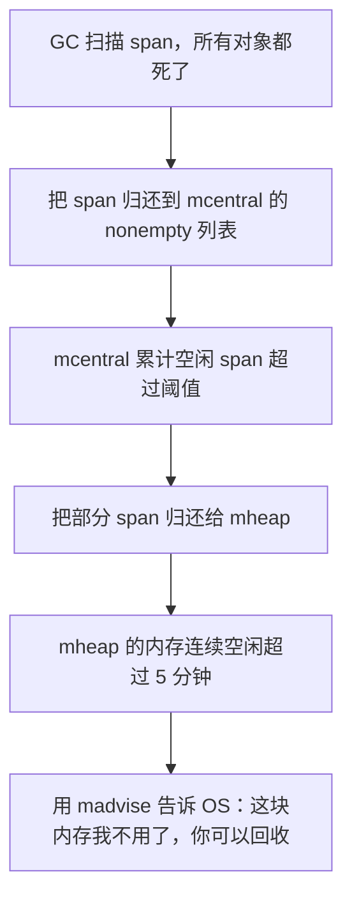

# Go 内存分配器底层原理深度解析

---

## 一、先搞懂：为什么需要内存分配器？

### 1. 直接用系统调用 malloc 的问题

| 问题 | 说明 |
|------|------|
| **系统调用开销大** | 每次分配都要进内核，从用户态切到内核态，几百纳秒开销 |
| **内存碎片严重** | 频繁分配释放小对象，产生大量外部碎片，内存利用率低 |
| **多线程锁竞争** | 所有线程都抢一个全局锁，并发场景锁竞争爆炸 |
| **缺页中断开销** | 每次分配新页都要触发缺页中断，还要清零 |

**结果：** 高并发场景下，C++ 程序的 malloc 经常成为性能瓶颈。

---

### 2. Go 内存分配器的设计思想：TCMalloc

Go 的内存分配器是基于 Google 的 TCMalloc（Thread-Caching Malloc）改造的，核心思想：

1. **分级缓存**：每个 P 有自己的本地缓存，大部分小对象分配无锁
2. **大小分类**：把对象分成几十种大小，每种大小用单独的 span 管理
3. **内存池**：预先向 OS 申请大块内存，切小了再分配出去
4. **工作窃取**：P 的本地缓存用完了，从其他 P 偷，或者从中央分配器拿

**性能目标：** 小对象分配开销 < 10ns，无锁！

**面试一句话总结：** Go 内存分配器就是"提前向 OS 要一大块内存，自己切成小块分级管理，每个 P 有自己的本地缓存无锁分配，不够了再从中央拿，不够了再向 OS 要"。

---

## 二、四个核心概念：mspan、mcache、mcentral、mheap

### 1. mspan：内存管理的基本单位

mspan 是 Go 内存管理的基本单位，类似操作系统的"页"，但比页大。

```go
// src/runtime/mheap.go
type mspan struct {
    next *mspan  // 双向链表，串起来
    prev *mspan

    startAddr uintptr // span 的起始地址
    npages    uintptr // 有多少个页（每页 8KB）

    sizeclass uint8  // 大小类，0~67，对应不同大小
    elemsize  uintptr // 每个元素的大小
    nelems    uintptr // 总共有多少个元素

    freeindex uintptr // 下一个可分配的元素索引
    allocBits gcBits  // 分配位图，标记哪个元素被分配了
    gcmarkBits gcBits // GC 标记位图

    // ... 其他字段
}
```

**关键：**
- 每个 mspan 管理连续的 `npages × 8KB` 内存
- 每个 mspan 只存同一大小类的对象
- 比如 sizeclass=6 就是 48 字节，所有 48 字节的对象都从这种 span 分配

---

### 2. mcache：每个 P 的本地缓存（核心！无锁分配）

**这是 TCMalloc 的精髓，也是 Go 内存分配快的根本原因！**

每个 P 都有自己专属的 mcache：

```go
// src/runtime/mcache.go
type mcache struct {
    // 大小类 1~67，每个大小类对应一个 mspan
    alloc [numSpanClasses]*mspan

    // ... 其他字段
}
```

**超级重要：**
- mcache 是 P 独有的，同一时间只有一个 M 在跑这个 P
- 所以访问 mcache **完全不需要锁！无锁！**
- 99% 的小对象分配都是直接从 mcache 拿，零锁开销，几十纳秒搞定

---

### 3. mcentral：每个大小类的中央缓存

每个大小类（共 68 个）对应一个 mcentral：

```go
// src/runtime/mcentral.go
type mcentral struct {
    lock      mutex    // 要加锁！
    nonempty  mSpanList // 有空闲元素的 span 列表
    empty     mSpanList // 没有空闲元素的 span 列表

    // ... 其他字段
}
```

**作用：**
- P 的 mcache 里某个大小类的 span 用完了，就来 mcentral 拿
- mcentral 是全局的，所以要加锁
- 一次拿一整个 span 回去，不是一个一个拿，降低锁的频率

---

### 4. mheap：全局的堆管理，对接 OS

```go
// src/runtime/mheap.go
type mheap struct {
    lock mutex  // 全局大锁！

    // 按页数管理的空闲 span
    free [_MaxMHeapList]mSpanList

    // 大 span（>128 页）放这里
    large mTreap

    // 所有 span 都在这里
    allspans []*mspan

    // 向 OS 申请的内存区域
    arenas [1 << arenaL1Bits]*arenaL2

    // ... 几十上百个其他字段
}
```

**作用：**
- mcentral 没 span 了，就来找 mheap 要
- mheap 没内存了，就向 OS 申请（mmap）
- 每次向 OS 申请一大块（至少 1MB），避免频繁系统调用

---

### 5. 四层结构总结

```mermaid
graph TD
    A[应用代码: make/new] --> B[mcache: P 本地缓存]
    B -->|span 用完了| C[mcentral: 大小类中央缓存]
    C -->|没 span 了| D[mheap: 全局堆管理]
    D -->|没内存了| E[操作系统: mmap 申请大块内存]

    style B fill:#9f9,stroke:#333,stroke-width:2px
    note over B: 无锁，最快，99% 命中
    note over C: 要加锁，一次拿一整个 span
    note over D: 全局大锁，最慢，尽量少触发
```

| 层级 | 所属 | 锁 | 速度 | 命中概率 |
|------|------|----|------|---------|
| **mcache** | 每个 P 一个 | ❌ 无锁 | 几十 ns | ~99% |
| **mcentral** | 每个大小类一个 | ✅ 有锁 | 几百 ns | ~1% |
| **mheap** | 全局一个 | ✅ 全局大锁 | 几 us | <0.1% |
| **OS** | 系统调用 | ✅ 进内核 | 几十 us | 极少 |

---

## 三、68 个大小类（Size Class）详解

Go 把所有对象大小分成了 68 个等级，叫 size class，从 0 到 67。

### 1. 大小类表（部分）

| sizeclass | 大小（字节） | 每页元素数 | 浪费率 |
|-----------|-------------|-----------|--------|
| 0 | 0 ~ 8 B | 1024 | 0% |
| 1 | 16 B | 512 | 0% |
| 2 | 32 B | 256 | 0% |
| 3 | 48 B | 170 | 0% |
| 4 | 64 B | 128 | 0% |
| 5 | 80 B | 102 | 4% |
| 6 | 96 B | 85 | 0% |
| ... | ... | ... | ... |
| 67 | 32768 B（32KB） | 1 | 0% |

**规律：**
- 小的时候间隔小（16, 32, 48...）
- 大的时候间隔大（几 KB 一跳）
- 控制每个 span 的浪费率 < 12.5%

---

### 2. 为什么要分大小类？

**解决两个核心问题：**

1. **减少内存碎片：** 同一大小的对象放一起，不会出现"大段空闲但放不下一个大对象"的情况
2. **快速分配：** 每个大小类有自己的 freelist，分配就是 O(1) 拿一个

**举个例子：**
- 你要分配 42 字节，向上取整到最近的 sizeclass，就是 48 字节（class 3）
- 从 mcache 的 class 3 对应的 span 里拿一个元素
- 搞定，几十纳秒

---

## 四、内存分配完整流程（面试必背！）

分三种情况：小对象、大对象、微对象。

### 1. 小对象（< 32KB）：99% 的情况

```mermaid
graph TD
    A[分配请求: size = 42B] --> B[向上取整到最近的 sizeclass: 48B, class=3]
    B --> C[去当前 P 的 mcache.alloc[3] 拿 span]
    C --> D{span 还有空闲元素吗?}
    D -->|有| E[从 span 拿一个元素，更新 freeindex，返回]
    D -->|没有| F[去 mcentral[3] 拿一个新 span 放到 mcache]
    F --> G{mcentral 还有空闲 span 吗?}
    G -->|有| H[拿一个 span 回 mcache，继续分配]
    G -->|没有| I[去 mheap 申请一组新的 page，切成 span 放到 mcentral]
    I --> J{mheap 还有空闲内存吗?}
    J -->|有| H
    J -->|没有| K[向 OS mmap 申请一大块内存，至少 1MB]
    K --> H
```

**关键点：**
- 99% 的分配在 mcache 层就搞定了，无锁，几十 ns
- mcache 用完了才去 mcentral 拿，一次拿一整个 span，不是一个一个拿，锁的频率很低
- mcentral 用完了才去 mheap 拿，mheap 用完了才向 OS 要，最慢

---

### 2. 大对象（>= 32KB）：直接走 mheap

大于等于 32KB 的对象不经过 mcache 和 mcentral，直接从 mheap 分配：

```go
// 伪代码
func largeAlloc(size uintptr) unsafe.Pointer {
    npages := size / pageSize
    if size % pageSize != 0 {
        npages++
    }
    // 直接去 mheap 拿 npages 个连续页
    span := mheap.alloc(npages)
    return span.startAddr
}
```

**为什么大对象不走 size class？**
- 32KB 以上的大小类不多，分类意义不大
- 大对象分配频率低，直接走 mheap 没关系
- 大对象分配了一般也用很久，缓存意义不大

---

### 3. 微对象（< 16B）：Go 1.14 新增优化

Go 1.14 引入了 tiny allocator，专门优化 16 字节以下的小对象：

```go
// 伪代码
func tinyAlloc(size uintptr) unsafe.Pointer {
    // 把多个 tiny 对象塞到同一个 16 字节的 slot 里
    // 比如 4 个 4 字节的放一起，8 个 2 字节的放一起
    // 大幅减少内存碎片
}
```

**效果：** 微对象内存利用率提升 20%+，分配速度更快。

---

## 五、内存释放与归还 OS

### 1. GC 标记完释放 span

GC 扫描完，如果一个 span 里所有对象都没被引用，整个 span 就可以释放：



---

### 2. Go 为什么不立即把内存还给 OS？

**因为：向 OS 申请内存很慢，要进内核！**

- 刚释放的内存大概率马上又要分配
- 先缓存起来，下次分配直接用，不用进内核
- 只有连续 5 分钟都没人用，才真的还给 OS

**所以你看 Go 进程的 RSS（常驻内存）：**
- 分配了内存 RSS 上去了
- GC 完了 RSS 不会立即下来
- 要等 5 分钟才会慢慢降下去
- 这是正常的，不是内存泄漏！

---

### 3. 强制归还内存

可以手动触发归还：
```go
debug.FreeOSMemory()  // 立即把所有空闲内存还给 OS
```

生产环境别乱调用，会导致后续分配变慢。

---

## 六、常见坑与最佳实践

### 坑 1：小对象分配太多导致 GC 压力大

```go
// ❌ 反模式：循环里创建大量小对象
for i := 0; i < 1000000; i++ {
    obj := &SomeStruct{X: i, Y: i}  // 每次都分配新对象
    process(obj)
}
```

**后果：** 每秒分配几百万对象，GC STW 时间爆炸。

**优化：对象池 sync.Pool**
```go
// ✅ 用 sync.Pool 复用对象
var pool = sync.Pool{
    New: func() interface{} { return &SomeStruct{} },
}

for i := 0; i < 1000000; i++ {
    obj := pool.Get().(*SomeStruct)
    obj.X = i
    obj.Y = i
    process(obj)
    pool.Put(obj)  // 用完放回去复用
}
```

**效果：** 分配次数减 99%，GC 压力大幅下降。

---

### 坑 2：字节切片容量预估错误，多次扩容

```go
// ❌ 没预估容量，append 多次触发扩容和内存拷贝
var buf []byte
for i := 0; i < 1000; i++ {
    buf = append(buf, data[i])  // 0 → 1 → 2 → 4 → 8 → ... 扩容 N 次
}
```

**优化：提前 make 足够的容量**
```go
// ✅ 提前预估容量，一次分配到位
buf := make([]byte, 0, 1000)
for i := 0; i < 1000; i++ {
    buf = append(buf, data[i])  // 零扩容，零拷贝
}
```

---

### 坑 3：大数组作为函数参数，值拷贝

```go
// ❌ 大数组传参，值拷贝，每次复制几十 KB
func process(arr [10000]int) {
    // ...
}
```

**优化：传指针或者用切片**
```go
// ✅ 传指针，只复制 8 字节
func process(arr *[10000]int) {
    // ...
}

// ✅ 或者用切片，切片结构体只有 24 字节
func process(arr []int) {
    // ...
}
```

---

### 最佳实践总结

1. ✅ **高频小对象用 sync.Pool 复用**，减少 GC 压力
2. ✅ **切片和 map 提前预估容量**，避免多次扩容拷贝
3. ✅ **大数组传参用指针或切片**，避免值拷贝
4. ✅ **不要在循环里反复创建临时对象**
5. ❌ **不要担心 RSS 下降慢**，这是正常的内存缓存策略

---

## 七、Go 版本演进历史

| Go 版本 | 内存分配器改进 |
|---------|--------------|
| Go 1.0 | 基于 TCMalloc 的第一版实现 |
| Go 1.5 | GC 改成三色并发标记，位图改成两个（allocBits + gcmarkBits） |
| Go 1.8 | 混合写屏障，mcentral 锁优化 |
| Go 1.10 | 大页（huge page）支持 |
| Go 1.14 | tiny allocator 优化 <16B 微对象，内存利用率 +20% |
| Go 1.17 | 栈拷贝优化，内存分配器锁粒度细化 |
| Go 1.19 | 软内存限制 GOMEMLIMIT，mheap 锁优化 |
| Go 1.21 | arena 内存池实验性功能，可手动管理整块内存 |

---

## 八、面试高频问答

| 问题 | 答案 |
|------|------|
| Go 内存分配器四个核心结构是什么？ | mspan（基本单位）、mcache（P 本地缓存，无锁）、mcentral（大小类中央缓存）、mheap（全局堆管理，对接 OS）。 |
| 为什么内存分配这么快？ | 因为每个 P 有自己的 mcache 本地缓存，99% 的小对象分配直接从 mcache 拿，完全不用加锁，几十纳秒搞定。 |
| 有多少个 size class？ | 68 个，从 8B 到 32KB，小的间隔小，大的间隔大，控制浪费率 <12.5%。 |
| 多大的对象算小对象？多大算大对象？ | <32KB 小对象走 mcache → mcentral → mheap；>=32KB 大对象直接走 mheap。 |
| tiny allocator 是干什么的？ | Go 1.14 引入，专门优化 <16B 的微对象，把多个小对象塞到同一个 slot，内存利用率提升 20%+。 |
| mcache、mcentral、mheap 哪个要加锁？ | mcache 是 P 本地的，无锁；mcentral 每个大小类一个锁；mheap 全局一个大锁。 |
| GC 完内存会立即还给 OS 吗？ | 不会，先缓存起来，连续 5 分钟没人用才会用 madvise 告诉 OS 可以回收。 |
| 为什么 RSS 下降很慢？是内存泄漏吗？ | 不是，Go 有内存缓存策略，释放的内存先留着下次用，5 分钟不用才还给 OS，这是正常的优化。 |
| 怎么优化 Go 程序的内存分配？ | 1. 高频小对象用 sync.Pool 复用；2. 切片 map 提前预估容量；3. 大结构传指针不传值；4. 减少循环内的临时对象创建。 |
| mcache 属于 G/M/P 哪个？ | 每个 P 有一个自己的 mcache，不是 G 也不是 M 的。 |
| 一个 span 多大？ | 一个 span 是 N 个 page，每个 page 8KB，所以 span 大小是 8KB 的整数倍。 |
| 为什么要分大小类？ | 减少内存碎片，同一大小放一起；加快分配速度，每个大小类有自己的 freelist，O(1) 分配。 |

---

## 九、一句话总结

> Go 内存分配器是 TCMalloc 思想的实现，四层结构 mcache → mcentral → mheap → OS，每个 P 有本地缓存无锁分配，68 个大小类减少碎片，小对象分配只要几十纳秒；记住 mcache 无锁是核心，用 sync.Pool 复用高频小对象，RSS 下降慢是正常的不是泄漏，内存分配面试基本就满分了。
