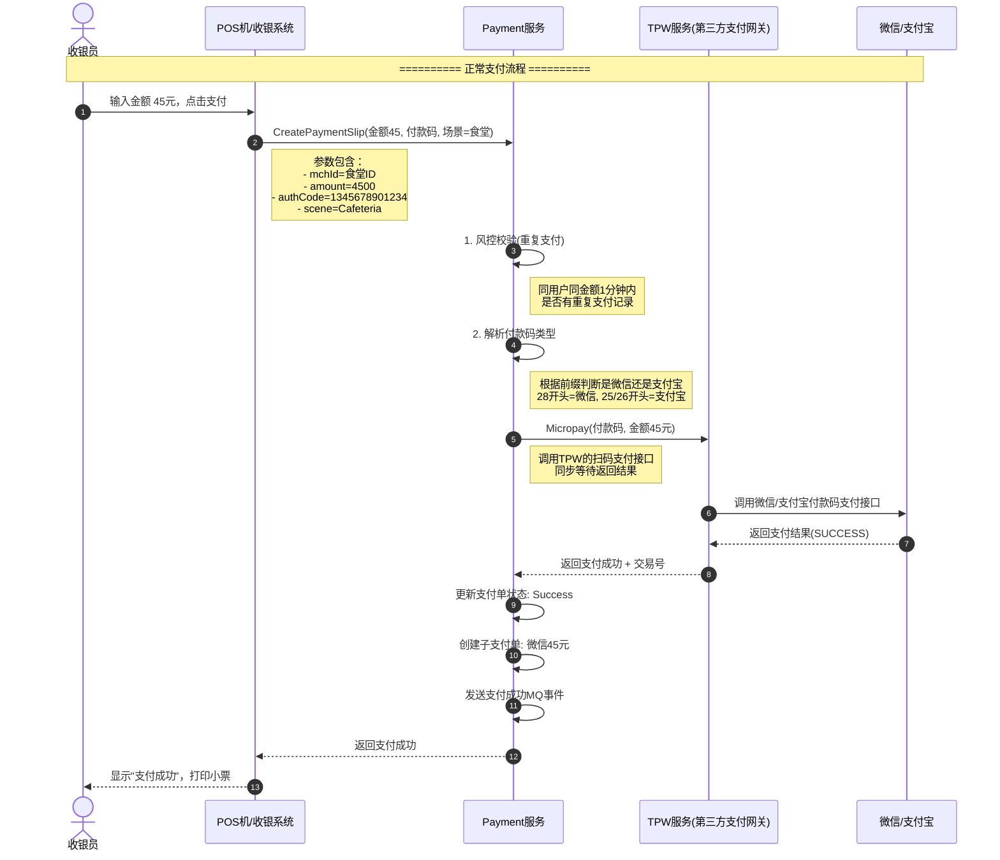
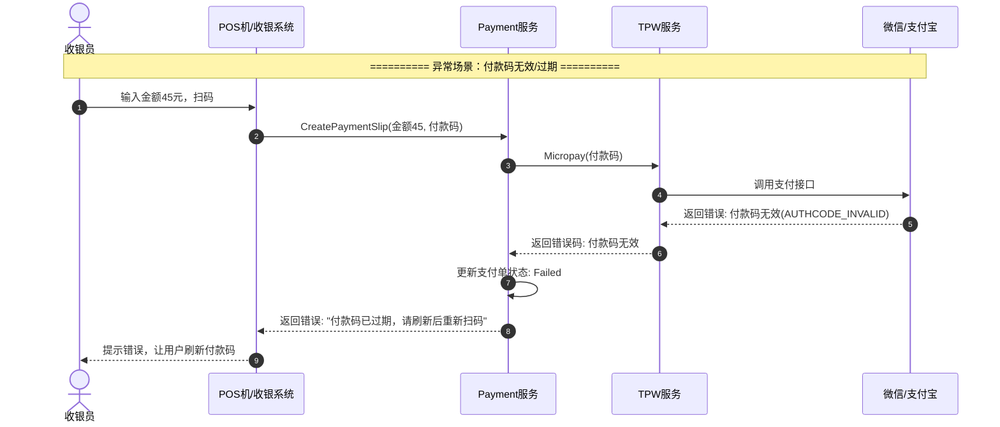
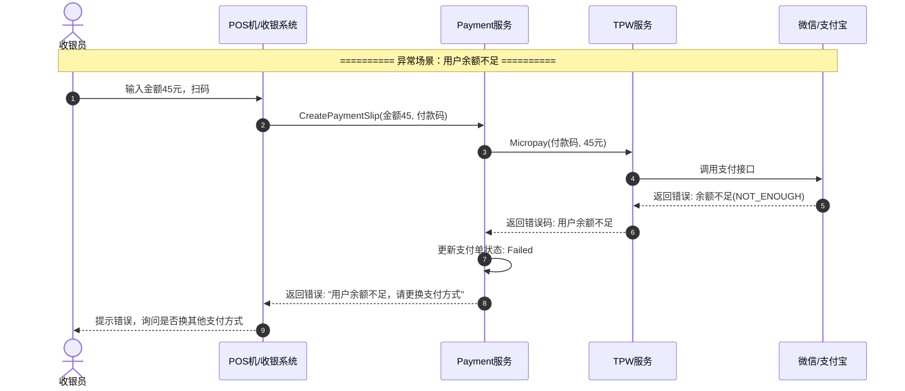
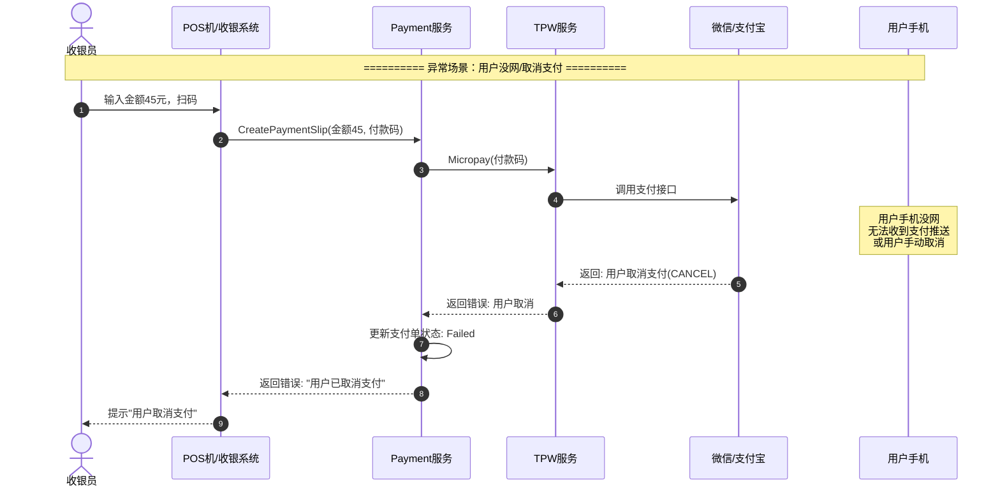
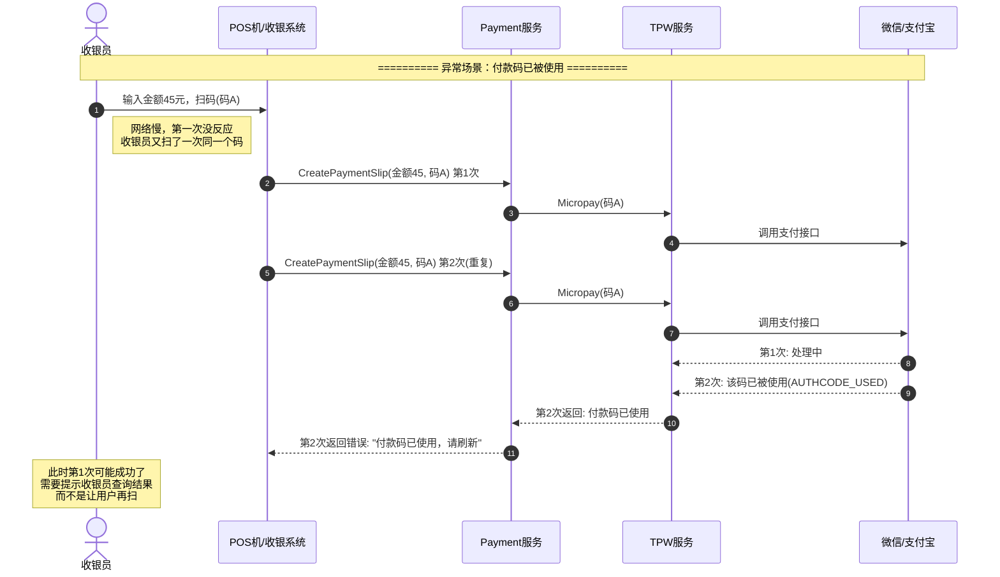
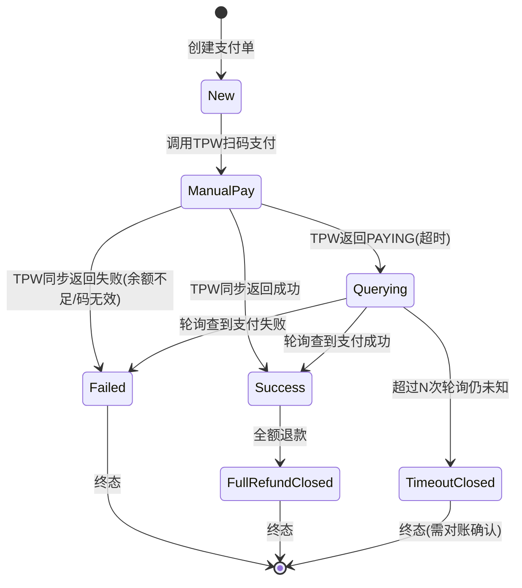

# 扫码支付完整流程时序图

## 一、场景说明

**扫码支付**（也称付款码支付、被扫支付）：
- **收银员** 使用扫码枪扫描用户手机上的付款码（微信/支付宝）
- **特点**：用户被动扫码，交互少，体验快，适合超市/食堂/便利店等场景
- **技术特点**：同步调用居多，超时情况复杂，需要良好的异常处理

---

## 二、正常流程时序图



---

## 三、完整异常流程时序图

### 3.1 付款码无效 / 已过期



---

### 3.2 用户余额不足



---

### 3.3 支付超时（最复杂的场景！）

```mermaid
sequenceDiagram
    autonumber
    actor 收银员
    participant POS as POS机/收银系统
    participant Payment as Payment服务
    participant TPW as TPW服务
    participant Wechat as 微信/支付宝
    participant Timer as 定时任务/轮询

    Note over 收银员,Wechat: ========== 异常场景：支付超时 ==========

    收银员->>POS: 输入金额45元，扫码
    POS->>Payment: CreatePaymentSlip(金额45, 付款码)
    activate Payment

    Payment->>TPW: Micropay(付款码)
    activate TPW
    TPW->>Wechat: 调用支付接口
    activate Wechat

    Note over Wechat: 微信侧处理超时<br/>(网络波动/系统繁忙)

    Note over TPW: TPW 等待超时<br/>(通常设置15秒)

    TPW-->>Payment: 返回: PAYING(支付中，不确定结果)
    deactivate TPW

    Note right of Payment: ⚠️ 关键：支付结果未知<br/>不能直接标记成功或失败

    Payment->>Payment: 更新支付单状态: ManualPay(支付中)
    Payment-->>POS: 返回: "支付处理中，请等待"
    POS-->>收银员: 显示"支付处理中..."，启动轮询
    deactivate Payment

    Note over 收银员,Timer: ========== 后续轮询处理 ==========

    loop 每3秒轮询一次，最多5次
        POS->>Payment: QueryPayResult(paymentSlipId)
        activate Payment
        Payment->>TPW: QueryOrder(外部交易号)
        TPW->>Wechat: 查询订单状态
        alt 用户已支付
            Wechat-->>TPW: 返回 Success
            TPW-->>Payment: 返回 Success
            Payment->>Payment: 更新状态: Success
            Payment-->>POS: 返回支付成功
            POS-->>收银员: 显示"支付成功"
            break 轮询结束
        else 用户未支付
            Wechat-->>TPW: 返回 NotPay
            TPW-->>Payment: 返回 NotPay
            Payment-->>POS: 返回支付中
        else 支付失败
            Wechat-->>TPW: 返回 Failed
            TPW-->>Payment: 返回 Failed
            Payment->>Payment: 更新状态: Failed
            Payment-->>POS: 返回支付失败
            POS-->>收银员: 显示"支付失败"
            break 轮询结束
        end
        deactivate Payment
    end

    Note over Timer: 定时任务兜底检查<br/>T+1对账最终确认
```

---

### 3.4 用户手机没网 / 取消支付



---

### 3.5 付款码已被使用（重复扫码）



---

## 四、完整的扫码支付状态机



---

## 五、异常处理汇总表

| 异常场景 | 错误码示例 | 处理方式 | 用户/收银员体验 |
|---------|-----------|---------|----------------|
| 付款码无效/过期 | `AUTHCODE_INVALID` | 直接返回失败 | "付款码已过期，请刷新" |
| 用户余额不足 | `NOT_ENOUGH` | 直接返回失败 | "余额不足，请换其他支付方式" |
| 付款码已被使用 | `AUTHCODE_USED` | 提示查询结果 | "该码已使用，请查看是否支付成功" |
| 支付超时/结果未知 | `PAYING` / `UNKNOWN` | 启动轮询 + 定时任务兜底 | "支付处理中，请稍候..." |
| 用户取消支付 | `CANCEL` | 直接返回失败 | "用户已取消支付" |
| 商户权限不足 | `NO_PERMISSION` | 直接返回失败 | "该商户不支持此支付方式" |
| 系统错误 | `SYSTEM_ERROR` | 重试 2 次，仍失败则返回 | "系统繁忙，请稍后重试" |

---

## 六、扫码支付 vs 普通支付的关键区别

| 维度 | 扫码支付（被扫） | 普通支付（主扫） |
|------|-----------------|-----------------|
| **交互方式** | 收银员扫用户 | 用户扫商户二维码 |
| **用户操作** | 出示付款码即可 | 扫码 → 输入密码 → 确认支付 |
| **同步/异步** | 大部分同步返回 | 完全异步，依赖回调 |
| **超时处理** | 复杂，需要轮询 + 兜底 | 简单，等回调即可 |
| **支付速度** | 快（1-3秒） | 慢（5-10秒） |
| **适用场景** | 超市、食堂、便利店 | 线上商城、扫码点餐 |
| **重试策略** | 不能随便重试（可能重复扣款） | 可以重复发起支付 |

---

## 七、关键设计要点

### 7.1 超时处理的"三保险"

```
1. 【接口同步返回】 TPW 接口 15 秒超时，返回 PAYING 状态
2. 【前端轮询】 POS 机每 3 秒查一次，最多 5 次
3. 【定时任务兜底】 10 分钟后定时任务主动去 TPW 查单，更新最终状态
4. 【T+1 对账最终确认】 第二天对账做最终一致性保证
```

### 7.2 幂等性保证

- 用 `out_trade_no`（商户订单号）作为幂等键
- 同一个订单号多次调用，结果一致
- TPW 侧也要保证幂等，同一笔订单不会重复扣款

### 7.3 退款的特殊性

- 扫码支付的退款和普通支付退款流程一致
- 但如果是超时场景，需要先确认支付结果，再发起退款
- 不能在"未知状态"下直接退款，可能退错

---

## 八、你可能忽略的业务细节

### 1. 为什么扫码支付超时不能直接标记失败？
> 因为 TPW 返回 PAYING 不代表支付失败！可能微信那边已经扣钱了，只是返回慢了。如果直接标记失败，用户钱扣了，订单状态是失败，就客诉了。
>
> ✅ 正确做法：标记为"支付中"，启动轮询，等确定了再更新状态。

### 2. 为什么同一个付款码不能扫多次？
> 微信/支付宝的付款码是一次性的，每 1 分钟刷新一次，使用过立即失效。如果扫了两次，第二次肯定失败，但第一次可能成功了，不能让用户再扫，否则重复支付。

### 3. 为什么食堂场景要做异步优化？
> 食堂高峰期（12:00-12:30）每秒几十笔，同步等 15 秒 POS 机就卡死了。
>
> 优化：POS 发请求后立即返回，后台异步处理，结果通过 WebSocket 推送给 POS，用户体验从 15 秒变 1 秒。

---

> 文档生成时间：2025-05-16
> 参考代码：`pay_channel.go` 中 `posPay()` 相关逻辑
