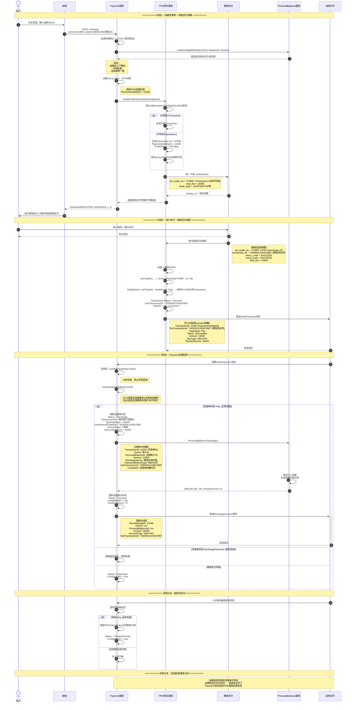
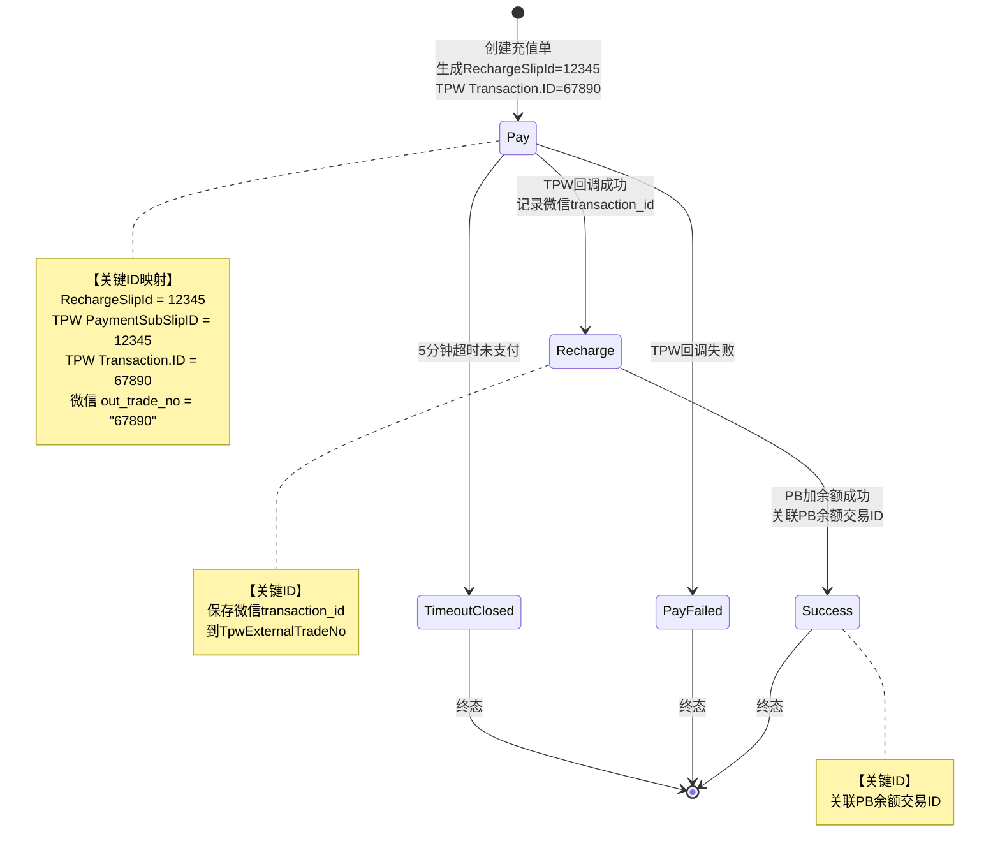

# 微信充值（非现金）完整流程示意图

## 一、核心ID流转关系说明

```
用户ID(UserId)
   ↓
个人余额账户ID(PersonalBalanceId)
   ↓
充值单ID(RechargeSlipId) 【Payment生成，全局唯一】
   ↓ 传给TPW
TPW Transaction:
   ID = TPW自己生成的主键(雪花ID)
   PaymentSubSlipID = 充值单ID 【Payment传过来的】
   ↓ 传给微信
微信 out_trade_no = TPW Transaction.ID（转字符串）
   ↓ 微信生成
微信 transaction_id = "420000xxxxxx"（微信侧唯一流水号）
   ↓ 微信回调TPW
TPW用Transaction.ID查库，找到PaymentSubSlipID
   ↓ TPW回调Payment
TransactionId = PaymentSubSlipID（充值单ID）
```

**核心设计**：TPW用自己的Transaction.ID作为微信的out_trade_no，而不是直接用Payment的充值单ID。这样TPW可以在内部保持自己的事务独立性，同时通过PaymentSubSlipID关联到Payment侧。

---

## 二、完整时序流程图（含异步通知）



---

## 三、充值单状态流转图



---

## 四、核心ID传递链路对照表

| 阶段 | ID名称 | 值示例 | 说明 | 持有者 |
|-----|--------|-------|------|--------|
| **创建充值单** | RechargeSlipId | 12345 | Payment生成，全局唯一 | Payment |
| **调用TPW** | PaymentTransactionID | 12345 | 传给TPW的参数，同充值单ID | TPW |
| **TPW创建Transaction** | PaymentSubSlipID | 12345 | TPW内部存储Payment传过来的ID | TPW |
| | Transaction.ID | 67890 | TPW自己生成的主键 | TPW |
| **调用微信** | out_trade_no | "67890" | TPW把自己的Transaction.ID转字符串传给微信 | 微信 |
| **微信回调** | transaction_id | "420000xxxxxx" | 微信侧唯一流水号 | 微信 |
| **TPW回调Payment** | TransactionId | 12345 | TPW用PaymentSubSlipID回调Payment | Payment |

---

## 五、关键字段对照表（充值单表）

| 字段名 | 值示例 | 说明 |
|--------|--------|------|
| `Id` | 12345 | 充值单ID，全局唯一，全链路传递给TPW作为PaymentSubSlipID |
| `UserId` | 678 | 用户ID |
| `PersonalBalanceId` | 999 | 个人余额账户ID |
| `Amount` | 10000 | 充值金额(分) |
| `Status` | Pay/Recharge/Success/PayFailed/TimeoutClosed | 充值状态枚举 |
| `TpwAccountId` | 1001 | TPW侧微信商户配置ID |
| `TpwPayScene` | JSAPI/NATIVE/POS等 | 支付场景枚举 |
| `TpwExternalTradeNo` | 4200001234567890 | 微信侧transaction_id，唯一标识这笔微信支付 |
| `AccountType` | Wechat | 支付账户类型 |
| `AccountSubType` | JSAPI | 支付账户子类型 |
| `ActivityAmount` | 0 | 活动赠送金额 |
| `CompletedAt` | 2024-01-15 12:30:45 | 完成时间 |

---

## 六、异常场景ID处理矩阵

| 异常场景 | ID处理方式 | 最终结果 |
|---------|-----------|---------|
| **重复回调** | 用RechargeSlipId查单，状态已为Recharge/Success直接返回 | 幂等，不重复处理 |
| **超时未支付** | 用RechargeSlipId查单，Status设为TimeoutClosed，调用TPW.CloseOrder(Transaction.ID=67890) | 订单关闭，可重新发起 |
| **回调比创建快(POS)** | 用RechargeSlipId自旋最多6次，每次500ms等单创建完 | 等单创建完再处理 |
| **无效回调(单不存在但支付成功)** | 用out_trade_no(67890)查到Transaction，用PaymentSubSlipID(12345)发起退款回滚 | 自动退款，防止资金损失 |
| **并发回调** | 用RechargeSlipId加分布式锁，串行处理 | 保证状态一致性 |

---

## 七、关键设计亮点

### 1. TPW的双层ID设计
- **Transaction.ID**：TPW自己的事务ID，传递给微信作为out_trade_no
- **PaymentSubSlipID**：Payment侧的充值单ID，用于TPW回调Payment时关联

**优势**：
- TPW与Payment解耦，各自维护自己的事务ID体系
- 微信侧只能看到TPW的ID，看不到Payment内部ID，安全性更好
- Payment换ID策略不影响TPW已有的微信订单

### 2. 分级查询策略
- 按PaymentSubSlipID查询：用于幂等和并发控制
- 按Transaction.ID查询：用于微信回调处理

### 3. 分布式锁的两个粒度
- `payment_sub_slip_key_{id}`：Payment侧的锁，用于防止重复创建单
- `transaction_key_{id}`：TPW侧的锁，用于回调处理

这样设计保证了：**Payment和TPW各自有自己的ID体系和锁粒度，同时通过PaymentSubSlipID建立关联**
