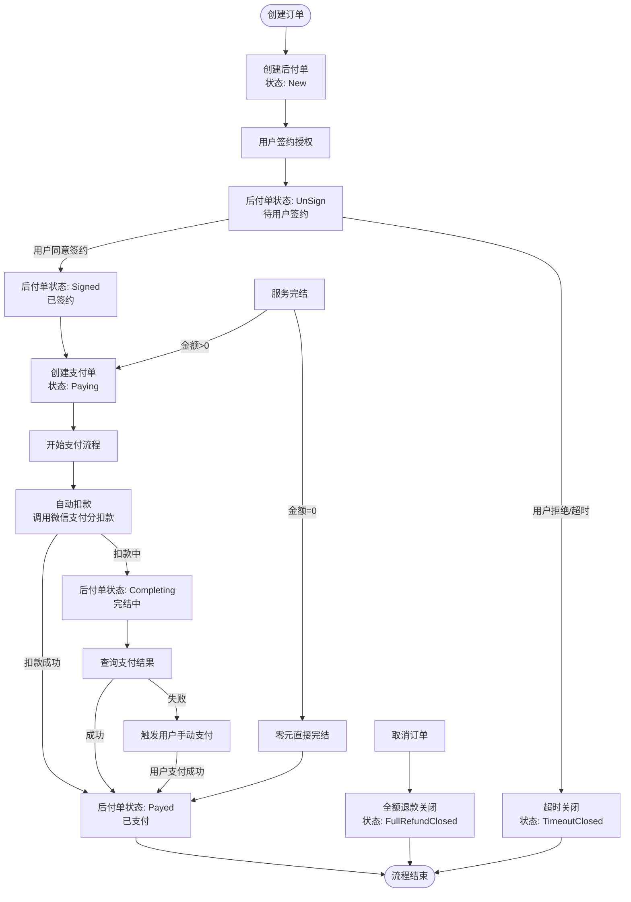

# 先享后付（微信信用付）业务流程

## 业务流程图

---

## 核心状态说明

### 后付单（PayAfterSlip）主要状态

| 状态 | 说明 |
|------|------|
| `New` | 初始状态，刚创建后付单 |
| `UnSign` | 待用户签约授权 |
| `Signed` | 用户已签约授权成功 |
| `Paying` | 支付中，已创建支付单 |
| `Completing` | 完结中，正在调用微信扣款 |
| `Payed` | 已支付完成 |
| `TimeoutClosed` | 超时未签约自动关闭 |
| `FullRefundClosed` | 全额退款关闭 |

### 后付子单（PayAfterSubSlip）主要状态

| 状态 | 说明 |
|------|------|
| `UnSign` | 用户待签约 |
| `Signed` | 用户已签约 |
| `Completing` | 完结中 |
| `Completed` | 已完结 |
| `Canceled` | 已取消 |

---

## 关键业务节点

1. **创建后付单** - 业务系统发起，关联外部订单号
2. **用户签约** - 跳转微信支付分进行授权，有签约超时机制
3. **服务完结** - 用户消费完成后调用完结接口
4. **自动扣款** - 完结后微信支付分自动从用户账户扣款
5. **手动支付** - 自动扣款失败时，唤起用户收银台手动支付
6. **取消/退款** - 支持订单取消和全额退款关闭

> 整个流程基于**微信支付分（WeChat Pay Score）**的信用支付能力，用户先享受服务后付款。
