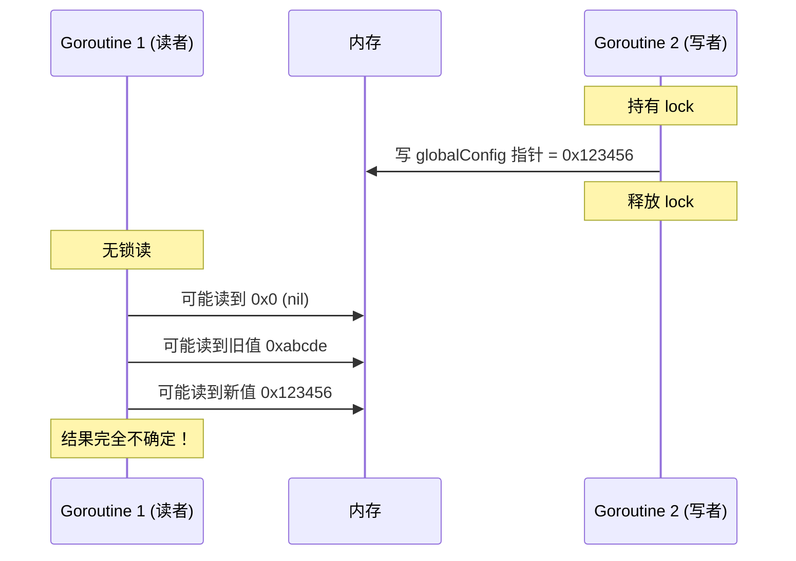
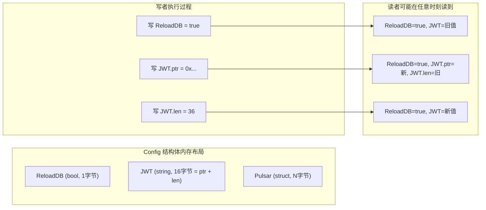

# 【事故案例】全局配置并发读写 Bug 完整分析

---

## 一、问题背景

### 1.1 原始代码

这是生产环境中真实出现的全局配置热加载代码：

```go
var (
    globalConfig *Config
    lock         sync.Mutex
)

// 无锁直接读指针
func GetGlobalConfig() *Config {
    return globalConfig
}

// 有锁写配置
func loadConfig(c *conf.Conf, cred *credentials.Credentials) {
    lock.Lock()
    defer lock.Unlock()

    var cfg Config
    err := c.UnmarshalKey("", &cfg)
    if err != nil {
        log.Panic("config unmarshal error", log.ErrField(err))
    }

    cfg.Pulsar.MQAuth = cred.MQAuth

    // first init
    if globalConfig == nil {
        globalConfig = &cfg
        globalConfig.JWT = cred.Identifier.JWT
        return
    }

    // on change
    if cfg.ReloadDB != globalConfig.ReloadDB {
        log.Info("reload db")
        globalConfig.ReloadDB = cfg.ReloadDB
        client.InitFromDBData()
        mch.InitFromDBData()
    }
}
```

### 1.2 故障现象

生产环境偶现：
- 配置 reload 后，部分服务仍然读到旧配置
- 偶现 panic：invalid memory address or nil pointer dereference
- 偶现字符串字段乱码、结构体字段不一致（部分新部分旧）
- `go run -race` 必报 data race warning

---

## 二、根因分析

### 🔴 Bug 1：globalConfig 指针本身存在数据竞争

**问题代码：**
```go
// 读者：无锁直接读指针
func GetGlobalConfig() *Config {
    return globalConfig  // ❌ 无锁读
}

// 写者：锁保护下写指针
func loadConfig(...) {
    lock.Lock()
    globalConfig = &cfg  // ❌ 有锁写
    lock.Unlock()
}
```

**根本原因：**

| 问题点 | 详细说明 |
|--------|----------|
| **数据竞争定义** | 多 goroutine 并发访问同一内存位置，至少一个是写，无同步保护 |
| **可见性问题** | Go 内存模型不保证无锁读取能看到写入的值，CPU 缓存可能不刷新 |
| **指令重排** | 编译器和 CPU 可能重排指令，指针赋值先于字段初始化完成 |
| **原子性问题** | 32 位系统上指针是 4 字节，64 位是 8 字节，理论上单字读写是原子的，但 Go 不保证 |

**Mermaid 时序图：**



**面试一句话总结：锁只能保护拿锁的人，不拿锁的人根本看不到锁。**

---

### 🔴 Bug 2：Config 结构体字段并发读写撕裂

**问题代码：**
```go
// 读者拿到指针后直接读字段
cfg := GetGlobalConfig()
fmt.Println(cfg.ReloadDB)    // ❌ 无锁读字段
fmt.Println(cfg.JWT)         // ❌ 无锁读字符串

// 写者在锁内修改字段
globalConfig.ReloadDB = cfg.ReloadDB  // ❌ 直接修改已发布的结构体
globalConfig.JWT = cred.Identifier.JWT
```

**根本原因：**

结构体是多字段的，写入不是原子的：



**最严重的后果：字符串撕裂**

string 在 Go 里是两个字（指针 + 长度）：
- 写者先写指针，再写长度
- 读者可能读到新指针 + 旧长度 → 越界访问 → panic
- 或者旧指针 + 新长度 → 读到随机内存

---

### 🔴 Bug 3：隐藏的功能 Bug（非并发问题）

**问题代码：**
```go
var cfg Config
c.UnmarshalKey("", &cfg)
cfg.Pulsar.MQAuth = cred.MQAuth  // ✅ cfg 里设置了

if globalConfig == nil {
    globalConfig = &cfg
    globalConfig.JWT = cred.Identifier.JWT  // ❌ JWT 直接写 globalConfig！
    return
}

// ❌ reload 时，cfg 里根本没有 JWT！永远不会更新！
```

**问题：**
- 第一次初始化没问题
- 后续 reload 配置时，`JWT` 和 `Pulsar.MQAuth` 永远不会更新
- 因为只把 `cfg.ReloadDB` 更新到 `globalConfig`，其他字段丢了

---

## 三、修复方案对比

### ✅ 方案 1：atomic.Pointer + 不可变结构体（推荐）

**适用场景：读多写少，配置热重载**

```go
import "sync/atomic"

var globalConfig atomic.Pointer[Config]

// 读者：100% 无锁，性能最好
func GetGlobalConfig() *Config {
    return globalConfig.Load()
}

// 写者：先完整构建，再原子发布
func loadConfig(c *conf.Conf, cred *credentials.Credentials) {
    lock.Lock()
    defer lock.Unlock()

    // 1. 完整构建新的 Config，所有字段都填好
    var cfg Config
    c.UnmarshalKey("", &cfg)
    cfg.Pulsar.MQAuth = cred.MQAuth
    cfg.JWT = cred.Identifier.JWT  // ✅ JWT 也放进 cfg

    // 2. 原子发布，读者要么拿到完整新的，要么完整旧的
    globalConfig.Store(&cfg)

    // 3. 检测变化执行业务逻辑
    old := globalConfig.Load()
    if cfg.ReloadDB != old.ReloadDB {
        log.Info("reload db")
        client.InitFromDBData()
        mch.InitFromDBData()
    }
}
```

**为什么这是最佳实践：**
1. ✅ 读者完全无锁，性能极致
2. ✅ 永远不会有部分更新，结构体完整构建好才发布
3. ✅ 原子操作自带内存屏障，可见性 100% 保证
4. ✅ `go run -race` 干干净净

---

### ✅ 方案 2：RWMutex + 返回拷贝

**适用场景：配置很大，或者需要频繁修改部分字段**

```go
var (
    globalConfig *Config
    configMu     sync.RWMutex
)

// 返回拷贝，caller 拿到自己的副本，不会和别人竞争
func GetGlobalConfig() Config {
    configMu.RLock()
    defer configMu.RUnlock()
    return *globalConfig  // ✅ 返回拷贝
}

func loadConfig(...) {
    configMu.Lock()
    defer configMu.Unlock()
    // 直接修改字段
    globalConfig.ReloadDB = cfg.ReloadDB
    globalConfig.JWT = cred.Identifier.JWT
}
```

**注意事项：**
- ❌ 千万不要返回指针，否则锁释放后 caller 还能修改字段
- ✅ 配置不大的话，拷贝开销完全可以忽略

---

### ❌ 不要用的方案

| 方案 | 为什么不好 |
|------|------------|
| 全局变量 + Mutex，Get 也加锁 | 读性能差，高并发下锁竞争严重 |
| atomic.Value 存储 interface{} | 需要类型断言，性能略差，容易出错 |
| 每个字段单独用 atomic | 代码丑陋，字段多了根本没法维护 |
| channel 通信发布配置 | 过度设计，配置场景不需要这么复杂 |

---

## 四、验证方法

### 4.1 Race Detector 验证

```bash
go test -race ./...
# 修复前：必报 data race
# 修复后：干干净净
```

### 4.2 并发压测验证

```go
func TestConfigConcurrency(t *testing.T) {
    // 启动 100 个读者
    for i := 0; i < 100; i++ {
        go func() {
            for {
                cfg := GetGlobalConfig()
                // 验证字段一致性
                if cfg != nil && cfg.JWT != "" && len(cfg.JWT) != 36 {
                    t.Error("JWT 长度不对，可能撕裂了")
                }
            }
        }()
    }

    // 启动写者不断 reload
    go func() {
        for i := 0; i < 1000; i++ {
            loadConfig(mockConf, mockCred)
            time.Sleep(1 * time.Millisecond)
        }
    }()

    time.Sleep(5 * time.Second)
}
```

---

## 五、面试高频考点

| 问题 | 标准答案 |
|------|----------|
| 这段代码有什么问题？ | 3 个问题：1) 指针无锁读有数据竞争 2) 结构体字段并发读写可能撕裂 3) reload 时 JWT 字段不会更新 |
| 为什么加了锁还有数据竞争？ | 锁只能保护拿锁的 goroutine，不拿锁的读者根本看不到这个锁 |
| 64 位指针读写不是原子的吗？为什么还有问题？ | 硬件原子性 ≠ Go 内存模型保证。即使 CPU 是原子读写，没有同步的话可见性和重排序还是有问题 |
| 读多写少的共享状态最佳实践是什么？ | 原子指针 + 不可变对象：写时完整构建新对象，原子发布，读者永远拿到一致快照 |
| 为什么不要直接修改已经发布的结构体字段？ | 读者可能读到部分更新的不一致状态，字符串等多字类型还可能撕裂 |
| sync.Map 也是这个思想吗？ | 是的！sync.Map 的 read map 就是只读的不可变快照，修改时建新的整体替换 |

---

## 六、一句话总结

> **全局配置并发读写的黄金法则：写时构建完整新对象，原子发布，读者永远拿到一致快照。不要在锁内修改已经发布的结构体字段，也不要无锁读写共享指针。这是 Go 里处理读多写少共享状态的标准最佳实践。**

---

## 七、扩展思考

**Q：为什么 Java 里用 volatile 关键字就行，Go 里没有？**
A：Go 没有 volatile，Go 的哲学是：**不要通过共享内存来通信，要通过通信来共享内存**。对于必须共享的场景，用 atomic 或 sync 包的同步原语，不要自己瞎猜内存模型保证。

**Q：atomic.Pointer 是 Go 1.19 才有的，旧版本怎么办？**
A：用 `atomic.Value`，存 `*Config`，类型断言一下。原理一样。

**Q：Rust 里这种问题编译期就报错了对吧？**
A：是的，Rust 的所有权系统会阻止你同时有多个可变引用。Go 靠程序员自己 discipline，这也是为什么 `go run -race` 一定要跑。

---

**标签：`数据竞争` `内存模型` `并发安全` `原子操作` `配置热重载`**
